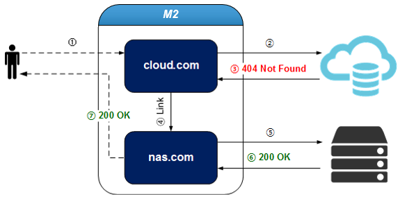
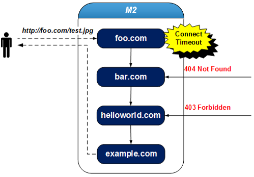

.. _engine-doc:

8장. 캐싱 엔진
******************

``M2`` 는 캐싱엔진으로 `STON Edge Server <https://ston.readthedocs.io/>`_ 를 탑재한다.
`STON Edge Server <https://ston.readthedocs.io/>`_ 의 강력한 캐싱 기능과 더불어 다양한 `Contents Service Patterns <https://csp-kr.readthedocs.io/>`_ 구현을 위한 확장기능을 제공한다.

.. toctree::
   :maxdepth: 2

.. _adv-vhost-link:

가상호스트 링크
====================================

콘텐츠가 여러 원본에 분산되어 있다면, 가상호스트 링크를 활용하여 콘텐츠가 통합되어 있는 것처럼 서비스가 가능하다.

.. note::

   - 이 기능을 활용하면 `인프라 구성 패턴 <https://csp-kr.readthedocs.io/ko/latest/patterns/pattern_infra.html>`_ 의 위치 투명성을 손쉽게 구현할 수 있다.

특히 On-Premise에서 클라우드로 스토리지를 마이그레이션하거나, 스토리지의 용량, 비용 등의 이유로 콘텐츠가 분산되어 있는 환경에서 유용하다.

   cloud.com에 없는 콘텐츠는 nas.com이 처리한다.

::

   # vhosts.xml - <Vhosts><Vhost>

   <VhostLink Condition="...">...</VhostLink>

-  ``<VhostLink>`` 요청을 위임할 가상호스트 이름. 콘텐츠에 대한 원본 응답이 ``Condition`` 을 만족하면 지정된 가상호스트로 요청을 위임한다. 단 하나만 설정할 수 있다.

   - ``Condition`` HTTP 응답코드/패턴(1xx, 2xx, 3xx, 4xx, 5xx), fail(원본에서 캐싱하지 못한 경우)

클라이언트 요청이 다른 가상호스트로 위임되더라도 :ref:`monitoring_stats_vhost_client` 와 :ref:`admin-log-access` 는 클라이언트가 접근한 가상호스트에 기록된다.

.. note::

   링크 관계에 있는 가상호스트 설정이 다를 경우 의도치 않게 동작할 수 있음을 주의한다.
   가상호스트 링크가 A(단순 캐싱) -> B(이미지 압축)로 맺어져 있다면,
   A에서 처리된 이미지는 압축되지 않지만 B에서 처리된 이미지는 압축된다.

예를 들어 nas.com의 콘텐츠를 cloud.com으로 이전 중일 경우, cloud.com에 없는(=404 Not Found) 콘텐츠에 대해서만 nas.com으로 요청을 보낼 수 있다.
아래의 경우 요청이 nas.com에 의해 처리되더라도 :ref:`monitoring_stats_vhost_client` 와 :ref:`admin-log-access` 는 cloud.com에 기록된다.

::

   # vhosts.xml - <Vhosts>

   // cloud.com에 없는(=404 Not Found) 콘텐츠는 nas.com에서 서비스한다.
   <Vhost Name="cloud.com">
     <VhostLink Condition="404">nas.com</VhostLink>
   </Vhost>

   <Vhost Name="nas.com">
   </Vhost>

:ref:`admin-log-access` 의 vhostlink 필드를 통해 클라이언트 요청이 어느 가상호스트에서 처리되었는지 알 수 있다.
"-" 는 요청이 링크되지 않았음을 의미하며 "nas.com" 은 해당 요청이 링크되어 nas.com에서 처리되었음을 의미한다. ::

    #Fields: date time s-ip cs-method cs-uri-stem ...(중략)... vhostlink
    2016.11.24 16:52:24 220.134.10.5 GET /web/h.gif ...(중략)... -
    2016.11.24 16:52:26 220.134.10.5 GET /favicon.ico ...(중략)... nas.com

링크가 여러 번 발생했다면 "+"를 구분자로 링크된 모든 가상호스트가 명시된다.
이 경우 가장 마지막에 위치한 가상호스트가 최종 요청을 처리한 가상호스트이다.

다음과 같이 여러 가상호스트를 다른 조건으로 링크할 수 있다.

::

   # vhosts.xml - <Vhosts>

   // 원본서버가 5xx로 응답했거나 캐싱하지 못했을 때(=fail) 해당 요청을 bar.com에게 위임한다.
   <Vhost Name="foo.com">
     <VhostLink Condition="5xx,fail">bar.com</VhostLink>
   </Vhost>

   // 원본서버가 4xx로 응답했을 때 해당 요청을 helloworld.com에게 위임한다.
   <Vhost Name="bar.com">
     <VhostLink Condition="4xx">helloworld.com</VhostLink>
   </Vhost>

   // 원본서버에서 403, 404 또는 5xx로 응답했을 때 해당 요청을 example.com에게 위임한다.
   <Vhost Name="helloworld.com">
     <VhostLink Condition="403,404,5xx">example.com</VhostLink>
   </Vhost>

   // 더 이상 위임하지 않는다.
   <Vhost Name="example.com">
   </Vhost>

   억지스럽지만 가능하다.

위 예제의 경우 foo.com의 :ref:`admin-log-access` 는 다음과 같다. ::

   #Fields: date time s-ip cs-method cs-uri-stem ...(중략)... vhostlink
   2016.11.24 16:52:24 220.134.10.5 GET /test.jpg ...(중략)... bar.com+helloworld.com+example.com

다음의 경우 링크는 즉시 중단된다.

* 대상 가상호스트가 존재하지 않는 경우 (foo.com -> ?)
* 자기 자신을 대상 가상호스트로 지정한 경우 (foo.com -> foo.com)
* 재귀링크(Recursive Link)가 발생한 경우 (foo.com -> bar.com -> foo.com)

