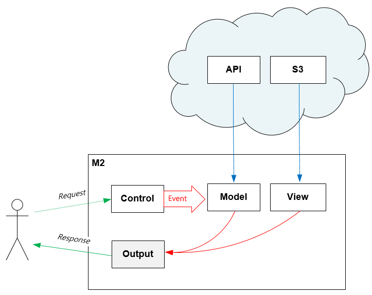

.. _mvc:

4장. Endpoint
******************

이 장에서는 M2의 동작 단위인 엔드포인트(Endpoint)에 대해 설명한다.
엔드포인트는 멀티로 구성이 가능하며 내부적으로 MVC(Model-View-Control) 구조로 동작한다.

.. _mvc-ston-conf:

가상호스트 설정
====================================

M2는 `STON 가상호스트 <https://ston.readthedocs.io/ko/latest/admin/environment.html#vhosts-xml>`_ 의 원본서버로 동작한다. 
다음과 같이 가상호스트를 생성한다. ::

   # vhosts.xml

   <Vhosts>
      <Vhost Name="www.example.com">

         <!-- [M2] Loopback:8585포트 사용 -->
         <Origin>
            <Address>127.0.0.1:8585</Address>
         </Origin>
         <Options>
            <BypassPostRequest Sticky="OFF">ON</BypassPostRequest>
            <BypassGetRequest Sticky="OFF">ON</BypassGetRequest>
            <BypassPutRequest Sticky="OFF">ON</BypassPutRequest>
         </Options>

         <!-- [M2] 배제금지 -->
         <OriginOptions>
            <Exclusion>0</Exclusion>
         </OriginOptions>

         <!-- [M2] 설정 -->
         <M2 Status="Active">
            ... (생략) ...
         </M2>
         
      </Vhost>
   </Vhosts>

.. note::
   
   ``<Bypass***Request>`` 설정이 모두 ``ON`` 인 이유는 캐싱을 하지 않겠다는 의미이다. 
   캐싱설정을 구성하면 ``TCP_MISS`` 계열의 요청만 M2로 보내진다.

엔드포인트 설정
====================================

엔드포인트는 ``<M2>`` 하위에 설정한다. ::

   # vhosts.xml - <Vhosts>

   <Vhost Name="www.example.com">
      ... (생략) ...
      <M2 Status="Active">
         <Endpoints>
            
            <Endpoint Alias="inven">
               <Model> ... </Model>
               <View> ... </View>
               <Control> ... </Control>            
            </Endpoint>

            <Endpoint Alias="platinum_user">
               <Model> ... </Model>
               <Control> ... </Control>            
               <View> ... </View>
            </Endpoint>

         </Endpoints>
      </M2>
   </Vhost>

``<M2>`` 태그의 ``Status`` 속성이 ``Active`` 일 때 활성화된다. 
각 ``<Endpoint>`` 하위에 MVC 설정를 구성한다.

-  ``<Model>`` - 엔드포인트가 참조하는 데이터 구성
-  ``<View>`` - 엔드포인트의 출력물 구성
-  ``<Control>`` - 엔드포인트 호출 인터페이스 설정

Control
====================================

클라이언트는 ``<Control>`` 주소을 통해 HTTP 인터페이스를 구성한다. ::

   # vhosts.xml - <Vhosts><Vhost><M2><Endpoints><Endpoint>

   <Control>
       <Path ModelParam="model" ViewParam="view" Post="off" Get="on">/banner</Path>
   </Control>
   

-  ``<Path>`` 엔드포인트를 게시(Publish)할 상대 URL을 설정한다. 

   -  ``ModelParam (기본: "model")`` 모델 참조시 사용된 ``#model`` 값
   -  ``ViewParam (기본: "view")`` 뷰 참조시 사용된 ``#view`` 값
   -  ``Post (기본: OFF)`` `POST Method`_ 허용 여부
   -  ``Get (기본: ON)`` `GET Method`_ 허용 여부

GET Method
------------------------------------

결합할 모델(=정보)과 뷰(=표현)를 QueryString으로 입력한다. ::

   GET /myendpoint?model=wine&view=soft

POST Method
------------------------------------

POST 메소드 캐싱은 권장하지 않지만, 단위 테스트 및 개발 용도로 지원된다. 
``<Path Post="off" ...>`` 인 경우 ``403 Forbidden`` 으로 응답한다.

Body와 QueryString을 혼합해 사용 가능하다. ::

   # GET 방식과 동일
   POST /myendpoint?model=wine&view=catalog
   
   { }

::

   # Model과 View 업로드

   POST /myendpoint

   {
        "model" : { ... },
        "view" : "<html>...</hmtl>"
   }

::

   # View만 업로드

   POST /myendpoint?model=wine

   {
       "view" : "<html>...</hmtl>"
   }

::

   # Model만 업로드
   POST /myendpoint?view=catalog

   {
       "model" : { }
   }

