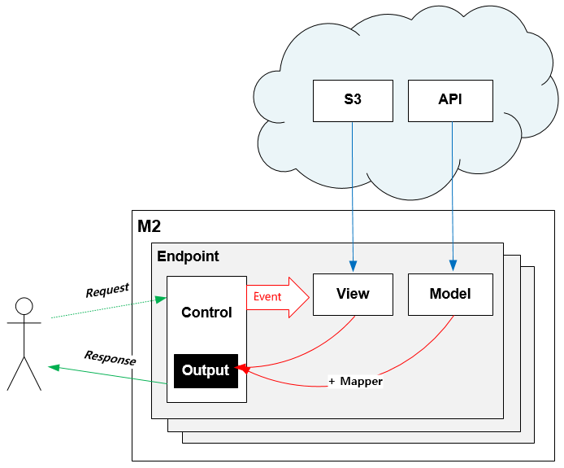

.. _mvc:

4장. Endpoint
******************

이 장에서는 M2의 동작 단위인 엔드포인트(Endpoint)에 대해 설명한다.
엔드포인트는 멀티로 구성이 가능하며 내부적으로 MVC(Model-View-Control) 구조로 동작한다.

.. _mvc-ston-conf:

가상호스트 설정
====================================

M2는 `STON 가상호스트 <https://ston.readthedocs.io/ko/latest/admin/environment.html#vhosts-xml>`_ 의 원본서버로 동작한다. 
다음과 같이 가상호스트를 생성한다. ::

   # vhosts.xml

   <Vhosts>
      <Vhost Name="www.example.com">

         <!-- [M2] Loopback:8585포트 사용 -->
         <Origin>
            <Address>127.0.0.1:8585</Address>
         </Origin>
         <Options>
            <BypassPostRequest Sticky="OFF">ON</BypassPostRequest>
            <BypassGetRequest Sticky="OFF">ON</BypassGetRequest>
            <BypassPutRequest Sticky="OFF">ON</BypassPutRequest>
         </Options>

         <!-- [M2] 배제금지 -->
         <OriginOptions>
            <Exclusion>0</Exclusion>
         </OriginOptions>

         <!-- [M2] 설정 -->
         <M2 Status="Active">
            ... (생략) ...
         </M2>
         
      </Vhost>
   </Vhosts>

.. note::
   
   ``<Bypass***Request>`` 설정이 모두 ``ON`` 인 이유는 캐싱을 하지 않겠다는 의미이다. 
   캐싱설정을 구성하면 ``TCP_MISS`` 계열의 요청만 M2로 보내진다.

엔드포인트 설정
====================================

엔드포인트는 ``<M2>`` 하위에 설정한다. ::

   # vhosts.xml - <Vhosts><Vhost>

   <M2 Status="Active">
      <Endpoints>
         
         <Endpoint Alias="inven" Post="OFF" Get="ON">
            <Control ViewParam="view" ModelParam="model">/store/inventory</Control>
            <Model>https://foo.com/#model</Model>
            <Mapper>https://foo.com/mapper.json</Mapper>
            <View>https://bar.com/#view</View>
         </Endpoint>

         <Endpoint Alias="platinum_user" Post="OFF" Get="ON">
            <Control ViewParam="myv" ModelParam="mym">/users/platinum</Control>
            <Model>https://alice.com/bob/#model.json</Model>
            <View>https://bar.com/#view</View>
         </Endpoint>

      </Endpoints>
   </M2>

``<M2>`` 태그의 ``Status`` 속성이 ``Active`` 일 때 활성화된다. 모델에 따라 독립된 ``<Endpoint>`` 를 멀티로 구성한다.

-  ``<Endpoint>`` 단위 엔드포인트를 설정한다.

   -  속성

      -  ``Alias (옵션)`` 엔드포인트의 별칭. 복합모델 생성에 사용.
      -  ``Post (기본: OFF)`` Post 메소드 허용 여부
      -  ``Get (기본: ON)`` Get 메소드 허용 여부

   -  하위 태그

      -  ``<Control>`` 서비스할 URL을 설정한다. ``ViewParam`` , ``ModelParam`` 속성을 통해 HTTP QueryString 키 값을 설정한다.
      -  ``<Model>`` 모델 API 주소를 설정한다. ``ModelParam`` 의 값이 ``#model`` 키워드로 치환된다.
      -  ``<Mapper>`` JSON 모델일 경우 바로 뷰에서 참조 가능하지만 ``Mapper`` 를 추가해 JSON을 변경하거나 다른 포맷을 공통 포맷(M2-JSON)으로 맵핑한다.
      -  ``<View>`` 뷰가 게시된 URL을 설정한다. ``ViewParam`` 의 값이 ``#view`` 키워드로 치환된다.

.. note::

   ``<Mapper>`` 가 하나인 이유는 M2의 철학에 기인한다.

   -  ``<Model>`` 은 상품정보처럼 다양하지만 그 형식은 단일하다. 그러므로 ``<Model>`` 을 해석/맵핑하는 방식은 단일하다.
   -  ``<Model>`` 과 ``<Mapper>`` 는 1:1의 관계이며 이를 하나의 ``<Endpoint>`` 로 게시한다.
   -  만약 단일한 모델 URL의 해석/맵핑 방식이 다양하다면 각각 구분된 ``<Endpoint>`` 로 구성해야 한다. 멀티 ``<Endpoint>`` 로의 라우팅은 STON이 처리한다.

Web API
====================================

클라이언트는 ``<Control>`` 주소를 HTTP로 호출한다.

.. note::

   Web API는 MVC의 C(Control)에 해당한다.

GET Method
------------------------------------

결합할 모델(=정보)과 뷰(=표현)를 QueryString으로 입력한다. ::

   GET /myendpoint?model=wine&view=catalog

POST Method
------------------------------------

POST 메소드 캐싱은 권장하지 않지만, 단위 테스트 및 개발 용도로 지원된다. 아래와 같이 설정을 활성화해준다. ::

   # vhosts.xml - <Vhosts><Vhost>

   <M2 Status="Active">
      <Endpoints>         
         <Endpoint Post="ON">
            ...
         </Endpoint>
      </Endpoints>
   </M2>

.. note::

   ``<Endpoint Post="OFF">`` 라면 403 Forbidden으로 응답한다.

Body와 QueryString을 혼합해 사용 가능하다. ::

   # GET 방식과 동일
   POST /myendpoint?model=wine&view=catalog
   
   { }

::

   # Model과 View 업로드

   POST /myendpoint

   {
        "model" : { ... },
        "view" : "<html>...</hmtl>"
   }

::

   # View만 업로드

   POST /myendpoint?model=wine

   {
       "view" : "<html>...</hmtl>"
   }

::

   # Model만 업로드
   POST /myendpoint?view=catalog

   {
       "model" : { }
   }

