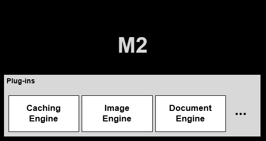

.. _getting-started:

3장. 시작하기
******************

이 장에서는 M2의 설정구조에 대해 설명한다. M2는 플러그인 아키텍처이기 때문에 각 모듈은 독립적으로 확장/교체 가능하다.

M2는 캐싱엔진으로 `STON <https://ston.readthedocs.io/ko/latest/>`_ 을 사용한다. 
따라서 이미 검증된 `STON <https://ston.readthedocs.io/ko/latest/>`_  기능들(설정, 로그, 통계, 모니터링 등)을 그대로 사용할 수 있다.

.. note::

   STON 모듈로 인해 리눅스 콘솔명령도 사용 가능하다. ::

      service ston start
      service ston stop
      service ston restart
      service ston status

.. toctree::
   :maxdepth: 2

.. _getting-started-serverconf:

서버 구성
====================================

- 최소 - 4코어 / 16GB
- 권장 - 4코어 / 32GB

.. _getting-started-os:

OS 구성
====================================

Cent OS 7.4이상만 지원한다.

.. _getting-started-install:

설치
====================================

최신버전의 M2를 설치한다. ::

   [root@localhost ~]# curl -o- http://winesoft.co.kr/m2/install.sh | sudo bash
   % Total    % Received % Xferd  Average Speed   Time    Time     Time  Current
                                    Dload  Upload   Total   Spent    Left  Speed
   100  1922  100  1922    0     0  85907      0 --:--:-- --:--:-- --:--:-- 87363
   
   ... (생략) ...

   Installing M2  20.04.0
   
   ... (생략) ...      

   Installation M2 Successfully
   Usage) service ston start|stop|restart|status

설치과정은 install.log에 기록된다. 로그를 통해 설치 중 발생하는 문제를 알 수 있다.

.. note:

   설치 스크립트에서 볼 수 있듯 `STON Edge Server <https://ston.readthedocs.io/ko/latest/>`_ 를 먼저 설치한다.

.. _getting-started-license:

라이선스 발급
====================================

신규 고객의 경우 다음 절차를 통해 라이선스를 발급한다.

* `신청양식 <http://www.winesoft.co.kr/lic_req.doc>`_ 작성
* license@winesoft.co.kr 로 전송
* 확인절차 후 발급

라이선스 파일(license.xml)이 반드시 설치경로에 존재해야 M2 정상적으로 구동된다.

.. _getting-started-update:

업데이트
====================================
최신버전이 배포되면 다시 설치한다.

.. _getting-started-samplevhost:

Hello World
====================================
vhosts.xml 파일을 열어 다음과 같이 편집한다. ::

    <Vhosts>
        <Vhost Name="www.example.com">
            <Origin>
                <Address>127.0.0.1:8585</Address>
            </Origin>
            <M2 Status="Active">
                <Endpoints>
                    <Endpoint>
                        <Control>
                           <Path>/banner</Path>
                        </Control>
                        <Model>
                           <Source>http://demo.winesoft.co.kr/m2/models/#model.json</Source>
                        </Model>
                        <View>
                           <Source>http://demo.winesoft.co.kr/m2/views/#view.html</Source>
                        </View>
                    </Endpoint>
                </Endpoints>
            </M2>
        </Vhost>
    </Vhosts>

.. _getting-started-runm2:

M2 실행
-----------------------------------------------
1. 발급받은 license.xml을 설치 경로에 복사한다.

2. M2를 실행한다.  ::

      [root@localhost ~]# service ston start

   M2를 중지하고 싶다면 stop 명령을 사용한다.  ::

      [root@localhost ~]# service ston stop

.. _getting-started-runcheck:

가상호스트 동작확인
-----------------------------------------------

(Windows 10 기준) C:\\Windows\\System32\\drivers\\etc\\hosts 파일에 다음과 같이
www.example.com 도메인을 설정한다. ::

    192.168.0.100        www.example.com

브라우저로 다음주소에 접근했을 때 아래 이미지가 정상적으로 서비스되면 성공이다. ::

   http://www.example.com/banner?model=sale&view=sample1

.. figure:: img/m2_09.png
   :align: center

::

   http://www.example.com/banner?model=sale&view=sample2

.. figure:: img/m2_10.png
   :align: center

::

   http://www.example.com/banner?model=sale&view=sample3

.. figure:: img/m2_11.png
   :align: center

이상의 이미지들은 아래 URL들을 M2가 조합한 결과물이다. ::

   // 모델 - 상품정보
   http://demo.winesoft.co.kr/m2/models/sale.json

   // 뷰 - 이미지 템플릿
   http://demo.winesoft.co.kr/m2/views/sample1.html
   http://demo.winesoft.co.kr/m2/views/sample2.html
   http://demo.winesoft.co.kr/m2/views/sample3.html

설정구조
====================================

`STON Edge Server <https://ston.readthedocs.io/ko/latest/admin/environment.html>`_ 와 동일하다.

