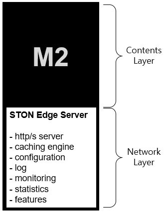

.. _getting-started:

3장. 시작하기
******************

이 장에서는 M2의 설정구조에 대해 설명한다. 
M2는 `STON Edge Server <https://ston.readthedocs.io/ko/latest/>`_ 를 엔진으로 사용한다. 
따라서 STON이 제공하는 다양한 기능과 관리기법들을 그대로 사용한다.

위 그림에서 알 수 있듯이 STON은 M2에 통합되어 있지만 다루는 계층이 명확히 구분되어 기능상 충돌은 없다. 

.. note::

   일관된 인터페이스를 위해 리눅스 콘솔명령 키워드도 ston을 그대로 사용한다. ::

      service ston start
      service ston stop
      service ston restart

M2에 추가된 기능에 대해서만 다룬다.

.. toctree::
   :maxdepth: 2

.. _getting-started-serverconf:

서버 구성
====================================

- 최소 - 4코어 / 16GB
- 권장 - 4코어 / 32GB

.. _getting-started-os:

OS 구성
====================================

Cent OS 7.4이상만 지원한다.

.. _getting-started-samplevhost:

Hello World
====================================
vhosts.xml 파일을 열어 다음과 같이 편집한다. ::

    <Vhosts>
        <Vhost Name="www.example.com">
            <Origin>
                <Address>127.0.0.1:8585</Address>
            </Origin>
            <M2 Status="Active">
                <Endpoints>
                    <Endpoint>
                        <Control>/banner</Control>
                        <Model>http://demo.winesoft.co.kr/m2/models/#mode.json</Model>
                        <View>http://demo.winesoft.co.kr/m2/views/#view.html</View>
                    </Endpoint>
                </Endpoints>
            </M2>
        </Vhost>
    </Vhosts>

.. _getting-started-runm2:

M2 실행
-----------------------------------------------
1. 발급받은 license.xml을 설치 경로에 복사한다.

2. M2를 실행한다.  ::

      [root@localhost ~]# service ston start

   M2를 중지하고 싶다면 stop 명령을 사용한다.  ::

      [root@localhost ~]# service ston stop

.. _getting-started-runcheck:

가상호스트 동작확인
-----------------------------------------------

(Windows 10 기준) C:\\Windows\\System32\\drivers\\etc\\hosts 파일에 다음과 같이
www.example.com 도메인을 설정한다. ::

    192.168.0.100        www.example.com

브라우저로 다음주소에 접근했을 때 아래 이미지가 정상적으로 서비스되면 성공이다. ::

   http://www.example.com/banner?model=sale&view=sample1

::

   http://www.example.com/banner?model=sale&view=sample2

::

   http://www.example.com/banner?model=sale&view=sample3

이상의 이미지들은 아래 URL들을 M2가 조합한 결과물이다. ::

   // 모델 - 상품정보
   http://demo.winesoft.co.kr/m2/models/sale.json

   // 뷰 - 이미지 템플릿
   http://demo.winesoft.co.kr/m2/views/sample1.html
   http://demo.winesoft.co.kr/m2/views/sample2.html
   http://demo.winesoft.co.kr/m2/views/sample3.html

설정구조
====================================

`STON Edge Server <https://ston.readthedocs.io/ko/latest/admin/environment.html>`_ 와 동일하다.

