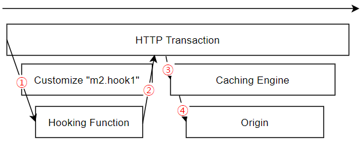

.. _hooking:

Appendix B: Hooking 함수
***********************

M2 후킹(Hooking) 함수를 이용하면 자유롭게 HTTP 트랜잭션을 제어할 수 있다. 

-  클라이언트 HTTP 요청에 대한 재정의
-  캐싱키 정의
-  원본 HTTP 요청에 대한 재정의

1.  클라이언트 요청을 M2의 Hooking 함수로 보낸다.

2.  Hooking 함수는 캐싱키와 ``MISS`` 시 원본에 보낼 요청을 정의하여 응답한다. ``200 OK`` 가 아니라면 M2RT는 ``403 Forbidden`` 을 응답한다.

3.  재정의된 캐싱키를 사용해 캐싱엔진에서 찾는다.

4.  원본 요청 시 Hooking 함수가 정의한 요청 모델을 참조해 원본서버에 요청한다.

.. note::

   Purge의 경우 2, 3 항에서 사용하는 캐싱 키를 사용한다.

.. _hooking-conf:

설정
====================================

아래와 같이 가상호스트 설정파일 ``/usr/local/ston/vhosts.xml`` 의 확장 커스터마이징으로 구성한다.  ::

   # vhosts.xml - <Vhosts><Vhost><Options>

   <Customize Name="M2_HOOK1">
      <OriginOptions>
         <ConnectTimeout>3</ConnectTimeout>
         <ReceiveTimeout>3</ReceiveTimeout>
      </OriginOptions>
      <Log Dir="/cache_log">
         <Origin Type="time" Unit="1440" Retention="10">ON</Origin>
      </Log>
   </Customize>

-  ``Customize`` 의 ``Name`` 속성이 ``M2_HOOK1`` 일 때만 활성화된다.
-  M2는 ``/usr/local/ston/svc/{가상호스트}/hook1.js`` 를 로딩한다.
-  Hooking 함수는 비동기 Loopback 통신으로 구성된다. 따라서 ``OriginOptions`` 의 ``ConnectTimeout`` , ``ReceiveTimeout`` 으로 최대 대기시간을 설정한다.
-  Hooking 함수에 대한 접근 로그를 origin.log 형식으로 구성한다.

.. _hooking-client:

클라이언트 요청후킹
====================================

클라이언트가 보낸 HTTP 요청을 M2-Core가 구동하는 Hooking 함수로 위임한다. ::

   {
      "host": "foo.com",
      "clientIp": "181.43.1.33",
      "sessionId": 2,
      "protocol": "http",
      "message": "POST /itemimage/LO/12/37/50/02/80/vdo/LO1237500280_1.mpx3123 HTTP/1.1\r\nHost: foo.com\r\nContent-Type: text/plain\r\nUser-Agent: PostmanRuntime/7.26.8\r\nAccept: */*\r\nPostman-Token: 0bce4527-7d8b-4974-9c2c-742efb8a549c\r\nAccept-Encoding: gzip, deflate, br\r\nConnection: keep-alive\r\nContent-Length: 519\r\nX-Forwarded-For: 181.43.1.33\r\n\r\n",
      "body": "<s:Envelope xmlns:s=\"http://schemas.xmlsoap.org/soap/envelope/\">\r\n  <s:Body>\r\n    <serviceCall xmlns=\"http://webservice.B2BOnline.com\">\r\n      <AvailRQ>\r\n        <AgencyId>JJSEL13157</AgencyId>\r\n        <CarrierCode>7C</CarrierCode>\r\n        <DepApoCode>CJU</DepApoCode>\r\n        <DepApoName></DepApoName>\r\n        <ArrApoCode>PUS</ArrApoCode>\r\n        <ArrApoName></ArrApoName>\r\n        <FlightDate>20171228</FlightDate>\r\n        <PaxCount>1</PaxCount>\r\n      </AvailRQ>\r\n    </serviceCall>\r\n  </s:Body>\r\n</s:Envelope>"
   }

-  ``host`` 요청을 처리하는 가상호스트 이름

-  ``clientIp`` 소켓 리모트 주소

-  ``sessionId`` 세션 고유번호 (access.log의 session-id 필드와 동일)

-  ``protocol`` 프로토콜 ( http, https, http2 )

-  ``message`` 클라이언트 요청의 HTTP 메시지

-  ``body`` 클라이언트 POST 요청의 HTTP Body. POST 요청이 아니라면 해당 필드가 없거나 값이 ``null`` .

개발 호환성을 위해 요청 헤더에 ``Content-Type: application/json`` 를 명시한다.

.. _hooking-error:

에러 처리
====================================

M2-Core가 ``200 OK`` 를 보내지 않는다면 ``510 Not Extended`` 응답과 함께 오류 메시지를 보낸다. ::

   {
      "name": "m2hook1", 
      "code": 403, 
      "body": "<HTML><TITLE>403 Forbidden</TITLE><BODY><H1>Forbidden</H1></BODY></HTML>"
   }

-  ``name`` m2hook1 (고정)

-  ``code`` M2-Core의 응답코드

-  ``body`` M2-Core가 보낸 Body

.. _hooking-overwrite:

요청 재정의
====================================

Hooking 함수의 응답에 클라이언트 HTTP 요청을 재정의한다. ::

   {
      "sessionId": 2,
      "response": {
         "code": 100,
         "body": "blah blah"
      },
      "cacheKey": "/availity?key={a,b,1}",
      "vhost": "bar.com",
      "originRequest": {
         "method": "POST",
         "url": "/itemimage/LO/12/37/50/02/80/vdo/LO1237500280_1.mpx3123",
         "headers": [
            { "key": "host", "value": "baq.com" },
            { "key": "x-custom-header", "value": "abcdefg" },
            { "key": "x-custom-header2", "value": "baq.com" },
            { "key": "cookie", "value": "NNB=LS3KUV63E5RV6; NRTK=ag#all_gr#1_ma#-2_si#0_en#0_sp#0;" }
         ],
         "body": "<s:Envelope xmlns:s=\"http://schemas.xmlsoap.org/soap/envelope/\">\r\n  <s:Body>\r\n    <serviceCall xmlns=\"http://webservice.B2BOnline.com\">\r\n      <AvailRQ>\r\n        <AgencyId>JJSEL13157</AgencyId>\r\n        <CarrierCode>7C</CarrierCode>\r\n        <DepApoCode>CJU</DepApoCode>\r\n        <DepApoName></DepApoName>\r\n        <ArrApoCode>PUS</ArrApoCode>\r\n        <ArrApoName></ArrApoName>\r\n        <FlightDate>20171228</FlightDate>\r\n        <PaxCount>1</PaxCount>\r\n      </AvailRQ>\r\n    </serviceCall>\r\n  </s:Body>\r\n</s:Envelope>"
      }
   }

-  ``sessionId`` 세션 고유번호 (디버그 용, USERDATA 개념)

-  ``resCode`` 응답코드

   -  ``100`` - Continue (흐름 지속)

   -  그 외에는 트랜잭션을 더 진행하지 않고 ``code`` 와 ``body`` 를 즉시 응답한다. 이는 디버깅에 용이하다.

-  ``cacheKey`` 캐싱엔진에서 사용할 키

-  ``vhost`` 변경될 가상호스트. 이 값이 NULL 또는 빈문자열 이라면 가상호스트를 변경하지 않는다.

-  ``originRequest`` 원본에 요청해야 하는 경우 HTTP 요청 구조체

.. note::

   요청을 재정의하지 않고 바이패스 시키고 싶다면 다음과 같이 응답한다. ::

      {
         "sessionId": 2,
         "response": {
            "code": 100
         },
         "cacheKey": null
      }

   -  ``response.code`` 를 ``100`` 으로 설정하여 요청을 진행시킨다.
   -  ``cacheKey`` 를 ``null`` 로 설정하여 캐싱엔진을 우회시키도록 한다. 

.. _hooking-overwrite-post:

POST 요청 상세
-----------------------------------------------

POST 요청을 Hooking 하려면 다음 설정이 선행되어야 한다. ::

   # server.xml - <Server><VHostDefault><Options>
   # vhosts.xml - <Vhosts><Vhost><Options>

   <BypassPostRequest>ON</BypassPostRequest>
   <PostRequest MaxContentLength="102400" BodySensitive="ON">ON</PostRequest>

-  바이패스하는 POST요청이라면 Hooking을 통한 재정의는 불필요하다.
-  Hooking 모듈을 동작시키려면 POST요청을 캐싱해야 한다.

캐싱엔진은 POST 요청에 대해 URL과 Body의 조합으로 캐싱키를 생성한다.
Hooking 모듈에 의해 요청이 재정의될 경우 다음과 같은 규칙을 따른다.

-  캐싱키는 Hooking 응답의 ``cacheKey`` 만을 사용한다. 클라이언트 POST 요청의 URL 및 Body는 무시된다.
-  캐싱엔진이 원본에 요청을 보낼 때는 Hooking 응답의 ``originRequest`` 만을 사용한다. 캐싱키 및 클라이언트 요청은 모두 무시된다.

정리하면 Hooking 모듈은 요청을 완전히 재정의하는 개념이기 때문에 POST 요청은 Hooking 모듈로 전달되기 전까지만 의미를 가진다고 볼 수 있다.

.. _hooking-smartapi:

Smart API
====================================

Hooking 함수를 이용해 Smart API 모듈을 구현한다. 
Smart API 모듈은 서비스 중단없이 교체가 가능하며 테스트 환경을 제공한다.

.. _hooking-smartapi-scheme:

모듈 규격
-----------------------------------------------

``hook1.js`` 모듈은 버전, 설정, 로직 3부분으로 나뉜다. ::

   /* 버전 = v10
      v10 - 유니코드 대응
      v9 - 캐싱키 변경
      ...
   */
   var _Ver = 10;

   // 설정 + 주석
   var includeMethodTag = false; // <Method> 태그를 [true=포함 | false=미포함] 한다.
   var maxItemCount = 64; // 최대 아이템 개수

   // 비지니스 로직
   // 고객 요구사항을 구현한다.

.. note::

   대부분의 모듈은 M2 개발팀과 고객의 협의에 의해 개발되지만 스펙 및 소스는 모두 오픈되어 운영된다.

.. _hooking-smartapi-staging:

검수/배포 시나리오
-----------------------------------------------

1. ``고객`` 동작하는 프로덕션 환경을 가지고 있다. 히트율 상승 및 호환성 확보를 위해 기술지원 담당자에게 수정을 요청한다.

2. ``M2`` 새 버전의 모듈을 개발 & 검수 한다. 고객에게는 항상 ``hook1.stage.js`` 로 전달된다.

3. ``고객`` ``hook1.stage.js`` 을 ``/usr/local/ston/svc/{가상호스트}/`` 경로에 배포한다. 반드시 설정을 Reload해야 모듈이 로딩된다.

4. ``고객`` 쿼리스트링 ``_m2.hook=stage`` 를 붙여 ``hook1.stage.js`` 모듈을 테스트한다. ::

      http://example.com/store/inventory?id=10&_m2.hook=stage

5. ``고객`` 다양한 호출을 통해 의도에 맞게 모듈이 동작하는지 검수한다. ::

      {
         "meta": {
            "ver": 10
         },  
         "request": {
            "url": "http://127.0.0.1/availity",
            "method": "POST",
            "headers": {
               "host": "baq.com",
               "cookie": "NNB=LS3KUV63E5RV6; NRTK=ag#all_gr#1_ma#-2_si#0_en#0_sp#0;"
            },
            "body": "<s:Envelope xmlns:s=\"http://schemas.xmlsoap.org/soap/envelope/\">\r\n  <s:Body>\r\n    <serviceCall xmlns=\"http://webservice.B2BOnline.com\">\r\n      <AvailRQ>\r\n        <AgencyId>JJSEL13157</AgencyId>\r\n        <CarrierCode>7C</CarrierCode>\r\n        <DepApoCode>CJU</DepApoCode>\r\n        <DepApoName></DepApoName>\r\n        <ArrApoCode>PUS</ArrApoCode>\r\n        <ArrApoName></ArrApoName>\r\n        <FlightDate>20171228</FlightDate>\r\n        <PaxCount>1</PaxCount>\r\n      </AvailRQ>\r\n    </serviceCall>\r\n  </s:Body>\r\n</s:Envelope>"
         },
         "hooking": {
            "sessionId": 2,
            "response": {
               "code": 200
            },
            "cacheKey": "/availity?key={a,b,1}",
            "vhost": "bar.com",
            "originRequest": {
               "method": "POST",
               "url": "/itemimage/LO/12/37/50/02/80/vdo/LO1237500280_1.mpx3123",
               "headers": [
                  { "key": "host", "value": "baq.com" },
                  { "key": "x-custom-header", "value": "abcdefg" },
                  { "key": "x-custom-header2", "value": "baq.com" },
                  { "key": "cookie", "value": "NNB=LS3KUV63E5RV6; NRTK=ag#all_gr#1_ma#-2_si#0_en#0_sp#0;" }
               ],
               "body": "<s:Envelope xmlns:s=\"http://schemas.xmlsoap.org/soap/envelope/\">\r\n  <s:Body>\r\n    <serviceCall xmlns=\"http://webservice.B2BOnline.com\">\r\n      <AvailRQ>\r\n        <AgencyId>JJSEL13157</AgencyId>\r\n        <CarrierCode>7C</CarrierCode>\r\n        <DepApoCode>CJU</DepApoCode>\r\n        <DepApoName></DepApoName>\r\n        <ArrApoCode>PUS</ArrApoCode>\r\n        <ArrApoName></ArrApoName>\r\n        <FlightDate>20171228</FlightDate>\r\n        <PaxCount>1</PaxCount>\r\n      </AvailRQ>\r\n    </serviceCall>\r\n  </s:Body>\r\n</s:Envelope>"
            }
         }  
      }

   
   -  (문자 그대로) 서로 다른 요청이지만 같은 ``cacheKey`` 를 가지도록 구현되었는지 검수한다.

   -  ``originRequest`` 를 통해 원본서버에 보내지는 요청이 바른지 검수한다.

   
   .. note::

      ``reponse.code`` 의 값은 항상 ``200`` 인데 이는 테스트 요청은 캐싱엔진이나 원본서버와 통신하지 않고 즉시 응답됨을 의미한다.

   
6. ``M2/고객`` 검수가 완료된 ``hook1.stage.js`` 를 ``hook1.js`` 으로 변경하고 설정을 Reload한다. 
   롤백상황을 고려하여 구 버전의 ``hook1.js`` 는 ``hook1.v9.js`` 처럼 버저닝을 통해 남겨준다.
