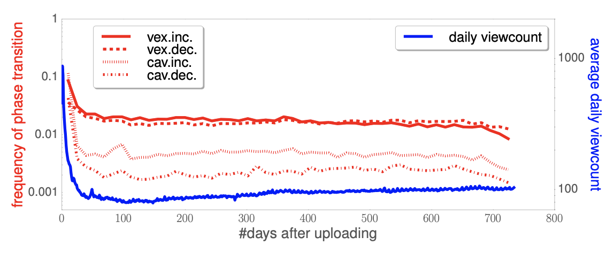

.. _intro:

1장. M2
**********************************

**M2** 는 **Web Service Modernizer** 이다.
M2를 통해 복잡한 백엔드의 수정없이 즉시 최신 트렌드의 콘텐츠를 고객에게 전달할 수 있다.

.. note::

   ``M2`` 의 다양한 유스 케이스는 `Contents Service Patterns <https://csp-kr.readthedocs.io/ko/latest/>`_ 으로 제공된다.

.. toctree::
   :maxdepth: 2

백그라운드
===================

스마트폰의 등장을 기점으로 컴퓨팅 환경은 엄청나게 변화했다.

   -  PC에서 Mobile로
   -  Monolithic Archicurecture에서 Micro-Service Architecture로
   -  Single Core에서 Multi Core로
   -  On-Premise에서 Cloud로

그 반대로 엔드유저의 콘텐츠 소비패턴은 지속적으로 짧아졌다.

   -  지난 주에 보았던 뉴스 기사의 이미지를 기억하는가?
   -  어제 인스타그램에 보았던 사진이 뭐였지?
   -  오늘 아침 출근길에 검색했던 상품 이미지가 무엇이었나?
   

하지만 **Workload** 를 처리하는 엔터프라이즈의 보수적인 인식은 크게 변하지 않았다.
그 중심에는 **Batch Processing (이하 Batch)** 이 다양한 형태로 자리잡고 있었다. 

   -  Batch process
   -  Migration
   -  Workflow
   -  Pipeline
   -  Legacy System

.. Hint:: M2는 "웹서비스가 어떻게 본질에 집중하면서 빠르게 변화에 대응해 나갈 것인가?" 에 대한 질문으로부터 시작되었다.

배치는 실패한다.
----------------------------------------

배치의 진행 단계를 살펴보자.

   1. 작업 목록을 작성한다.
   2. 대상 서버들을 산정한다.
   3. 프로세스를 수행한다.
   4. ...........기다린다........
   5. ...기도한다...기도한다...기도한다...기도한다...기도한다
      
      .. figure:: img/nobatch04.png
         :align: center

   6. “Complete” 메시지를 보며 신의 존재를 느낀다.

이 방식은 곧 한계를 드러냈는데 (신이 없었기 때문이 아니라) 배치 프로세스의 근본적인 문제 때문이다.

첫째, **배치는 항상 Legacy를 남긴다.**
레거시는 다소 부정적인 의미를 가지는데 대충 **“구축해서 돌고 있지만, 건드릴 수 없는 시스템”** 정도로 이해할 수 있다. 
최악은 배치를 관리할 목적으로 만들어진 DB(데이터 베이스) 기반 시스템이다. 
DB를 넣는 순간 주객이 전도되어 DB 관리가 첫 번째 미션이 된다.
기획이 바뀌는 순간 모든 배치는 수습해야할 대상이 되버리고 긴 겨울이 시작된다. 

둘째는 통제 모델의 한계 때문이다. 
배치를 시작하려면 항상 작업규모를 설정해야 한다. 
그리고 최선을 다해서 실행한다. 
이 모델이 매우 당연하게 여겨진다면 다음 문제에 대해 생각해보자.

   - 모든 상품 이미지에 대해 신규 썸네일 해상도를 지원하는데 얼마나 소요될까요?
   - 최신 아이폰 해상도에 맞추어 모든 상품기술서를 변경하는데 얼마나 소요될까요?
   - 상품이 계속 유입되는데 내일 아침 서비스에 노출할 수 있을까요?

서비스가 커질수록 변동성/불확실성은 커지게 되고 임계점을 넘어가는 순간 지금껏 유효했던 해법들은 한계를 드러낸다. 
이러한 기술부채를 갚지 못한다면 영원한 이자를 내야 한다. 

.. note::

   배치는 그 결과물의 가치가 저장/관리 비용보다 높을 때에만 유의미하다. 
   그렇지 않다면 그 형태와 무관하게 이자를 피할 수 없다.

이제는 날아야 할 때
----------------------------------------

``On the fly`` 방식은 ``Batch`` 와 정반대의 철학을 가진다.
무엇도 미리 만들어 두거나 결정하지 않는다.
요청하면 즉시 "연결" 하고 "결합" 하여 "생산" 한다.
언제나 정보는 최신이며 변화도 즉시 이루어진다.

다음은 ``On the fly`` 방식이 바꾸어 놓은 사례들이다.

   - 데이터 마이그레이션과 서비스를 동시에 수행한다.
   - 사용자에게 전달하는 이미지 형태를 즉시 결정하여 배포한다.
   - 사전에 기획된 이메일 마케팅, 이제는 여는 시점에 조합된 최신의 데이터로 생성 후 사용자에게 전달한다.
   - 모든 영역의 콘텐츠를 개인화한다.
   - Mixed Content. 제휴 사업자 컨텐츠가 얼마나 많은지, 얼마나 소비될지 몰라도 대처가 가능하다.
   - 덩치 큰 동영상. 사이즈마다 모두 미리 트랜스코딩하지 않는다. 저장 비용까지 아끼는 것은 덤.
   - 동영상 속 썸네일 이미지 추출. API 콜 하나로 끝.
   - 너무나 긴 상품 이미지. 디자이너가 일일이 자르는 건 그만! 자동화한다.
   - 더 이상 디자이너가 일일이 문구를 수정하지 않는다.

비즈니스 문제를 바라보는 관점의 전환만으로도 믿을 수 없이 유연하고 경제적인 해답을 얻을 수 있다. 

.. note::

   ``On the fly`` 는 기존 인프라의 변화(Change)를 요구하지 않는다.
   그저 기존 방식대로 연결(Connect)할 뿐이다.

M2의 이해
===================

웹 서비스 현대화(Web Service Modernization)는 단순히 이미지나 웹페이지 처럼 눈에 보이는 산출물에 국한되지 않는다.

   - Contents Modernization
   - Process Modernization
   - Operation Modernization
   - Communication Modernization

M2가 가져오는 4가지 변화를 통해 보다 빠르고 민첩(Agile)하게 `BizDevOps <https://enterprisersproject.com/article/2019/9/devops-what-is-bizdevops>`_ 를 수행할 수 있다.

한가지 주의할 점은 구식(우리가 AS-IS 또는 Legacy 라고 부르는 것들)에 대한 인식이다.
구식은 여전히 유의미하며 대체/제거에는 비용이 따른다.

**M2** 는 이미 존재하는 백엔드/콘텐츠/API들과 트렌디한 모듈들을 실시간 방식(On the fly)으로 결합하는 프레임워크로 기능한다.

Contents Modernization
----------------------------------------

**M2** 는 아주 효율적인 콘텐츠 생산자(Producer) 이다.

M2는 웹서비스에서 제공하는 다양한 콘텐츠(도큐먼트, 이미지, 비디오 등)를 다루는데 최적화되었을 뿐만 아니라 다양한 서비스에서 이미 10년 이상 검증되었다.
`STON <https://ston.readthedocs.io/ko/latest/index.html>`_ 으로 널리 알려진 ``M2 Caching Engine`` 은 모든 콘텐츠에 대한 신뢰도와 반응성을 향상시킨다.

  -  실시간 웹페이지 분석을 통해 화면깨짐, 유해요소를 찾아내어 수정한다.
  -  1장의 원본 이미지로부터 무한대의 이미지를 생산한다.
  -  1개의 비디오로부터 API, 썸네일, GIF, 트랜스코딩를 즉시 생산한다.
  -  여러 웹페이지를 편집하여 완결된 PDF 문서를 제공한다.

Process Modernization
----------------------------------------

**M2** 에서 모든 것은 URL로 노출된다.

복잡한 Micro-Service에 대한 연계도 단일 URL 호출에서 손쉽게 연결이 가능하다.
더 이상 복잡한 트래픽 Flow나 장애에 대해 일일이 고민하지 않아도 된다.
이미 `Contents Service Patterns <https://csp-kr.readthedocs.io/ko/latest/>`_ 으로 정리된 다양한 서비스 모델은 즉시 사용이 가능하다. ::

   https://foo.com/product/img.jpg

이 단순한 호출이 이루어질 때 M2의 `백업 파이프 패턴 <https://csp-kr.readthedocs.io/ko/latest/patterns/pattern_infra.html#pattern-infra-backup>`_ 을 즉시 적용할 수 있다.

  1.  NAS를 검색한다.
  2.  존재하지 않는다면 Object Storage를 검색한다.
  3.  존재하지 않는다면 외부 셀러 이미지를 다운로드 받는다.
  4.  다운로드 받은 이미지를 최적화하여 Object Storage에 업로드한다.
  5.  클라이언트에게 노출할 때는 용량과 크기를 최적화하여 전송한다.

약속된 1줄의 URL만으로 모든 기능은 Mesh로 연결되어 동작한다.

Operation Modernization
----------------------------------------

**M2** 는 검증된 운영기법을 제공한다.

고객이 M2를 만지는 대부분의 시간은 운영이다.
**M2** 의 운영기법은 `STON <https://ston.readthedocs.io/ko/latest/index.html>`_ 을 토대로 개발되었다.
개발자원과 무한히 연동가능하지만 너무도 손쉬운 운영, 그것이 M2의 지향점이다.

   -  상태를 가지지 않는다. 장애처리 비용이 없다.
   -  병렬 확장가능한 구조를 통해 무한대의 가용량을 확보할 수 있다.
   -  실시간 모니터링은 모든 지표를 추적 가능하도록 만든다.
   -  트래픽, 시스템, 모듈, 통합 등 모든 것은 통제 가능하며 개발사의 지원을 받는다.

복잡함과 연계에는 임계지점이 존재한다.
M2는 레거시의 바다에 빠지지 않도록 지속적인 복잡함을 해체한다.

Communication Modernization
----------------------------------------

개념적으로 연결할 수 있다면 M2로 쉽게 프로토타이핑이 가능하다.
복잡한 백엔드 어느 곳도 영향을 주지 않는다.
더 이상 개발/운영적인 이야기 없이 보고 만지며 개선 방안을 찾을 수 있다.

  -  그냥... 영상 올리면 YouTube 처럼 됐으면 좋겠어요.
  -  제품 이미지에 현재 가격과 재고를 표기하고 싶어요.
  -  제품 리뷰 동영상을 업로드 하자마자 고객이 썸네일 이미지를 고르게 하고 싶어요. 우수고객 뱃지까지 달아주면 좋을 것 같아요.

``M2`` 는 기획, 운영, 개발 사이의 장벽을 허문다.
