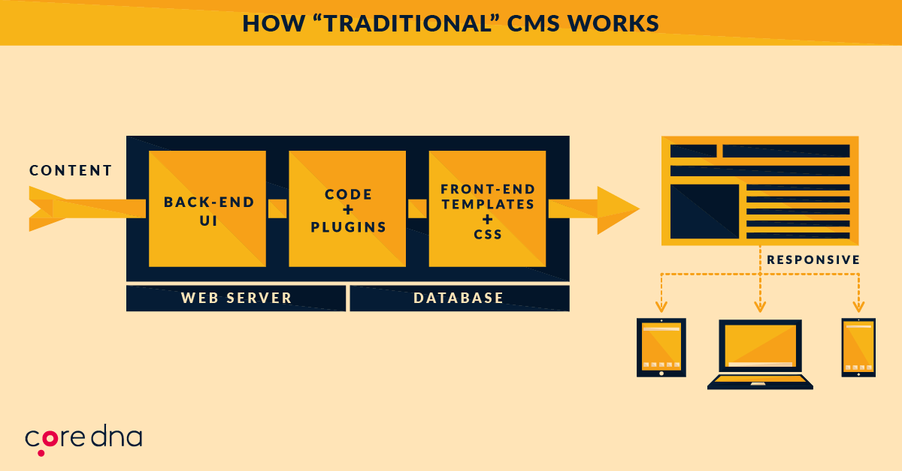
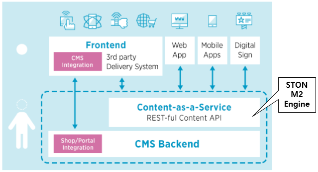

.. _intro:

1장. M2
**********************************

**M2** 는 E-Commerce의 **Headless/Decoupled CMS** 를 위한 미들웨어이다.

- 고객중심의 마케팅 민첩성(Agile marketing) 향상
- 컨텐츠 생산공정/시간 단축
- 클라이언트 서비스 품질 향상
- 다양한 채널로의 컨텐츠 전파력 강화
- 손쉬운 개인화
- TCO 절감

.. note::

   **Headless/Decoupled CMS** 에 대한 더 많은 정보를 원한다면 :ref:`references` 를 참고한다.

.. toctree::
   :maxdepth: 2

CMS의 진화
===================
고전적인(Traditional) CMS는 컨텐츠를 결합된 형태로 미리 생성하여 데이터베이스에 저장한다. 저장된 컨텐츠는 그대로 클라이언트에게 전송된다. 콘텐츠가 반응형으로 제작되었다면 좀 더 나은 경험을 제공할 수 있다.

이러한 시스템은 데이터베이스를 중심으로 설계되어 명확한 단점을 가진다.

- 복잡하다.
- 확장성이 낮다.
- 느리다.
- 재사용성이 떨어진다.
- 점진적인 개선이 어렵다.
- 모든 컨텐츠가 미리 정의되어 있어야 한다.
- 디자인 요소를 변경하려면 개발이 필요하다.

**MSA(Micro Service Architecture)** 도입과 함께 재사용성과 유연성을 높이기 위한 다양한 시도가 **Headless CMS** 라는 개념으로 정립되었다. 이 개념은 얼핏 생소해 보이지만 E-Commerce에서는 이미 널리 사용되고 있다. 셀러들이 오픈마켓등에 자신의 상품을 등록할 때 상품기술서등을 **HTML 코드조각** 으로 올리고 있으며 이 **HTML 코드조각** 이 각 사의 프론트엔드와 결합되어 엔드유저에게 전달된다.

.. figure:: img/coredna_02.png
   :align: center

**Headless CMS** 에서는 시각적 결과물을 얻기 위해서 프론트 엔드의 개발이 필수적이다. 이는 마케팅 관점에서는 매우 불리한 접근으로 개발이 선행되지 않으면 최종 산출물을 확인할 수 없다. 개선 프로세스에도 반드시 개발이 포함되어 마케팅 민첩성을 저하시킨다.

반면, **Decoupled CMS** 는 데이터베이스나 프론트엔드 구성요소와 완전히 분리되어 그 자체로 시각화할 수 있다. 이는 마케팅 담당자에게 커다란 자유를 줄 뿐만 아니라 그 자체로 훌륭한 산출물이 된다. 개별 컨텐츠를 옴니 채널로 선별적으로 전달하거나 이를 결합하여 웹 페이지를 얼마든지 자유롭게 만들 수 있다.

왜 M2 인가?
===============

시장에는 **Headless/Decoupled CMS** 를 위한 다양한 플랫폼들이 존재한다. 하지만 기업의 복잡한 백엔드의 구조적 변화와 이에 대한 노력과 시간은 결코 적은 비용이 아니다. 

**M2** 는 기업의 CMS와 API로 연동하는 미들웨어로 **Content as a Service** 를 구축한다.

- **Headless/Decoupled** 컨텐츠(웹페이지, 이미지 등) 생성
- 프론트엔드 개발 없는 실시간 정보 바인딩
- 이미지 전송 최적화 및 가속
- 웹 페이지 가속
- 개인화 컨텐츠 최적화
- 백엔드 부하 절감