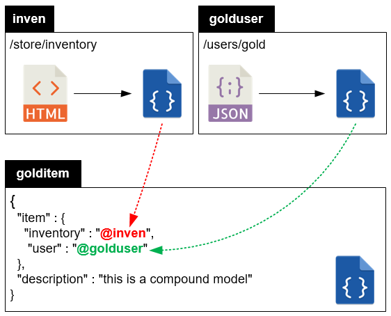
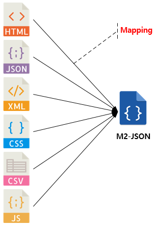

.. _mvc:

4장. MVC 설정
******************

이 장에서는 MVC 설정에 기반한 M2의 동작원리에 대해 설명한다. 
M2의 MVC 동작구조는 다음과 같다.

.. figure:: img/m2_13.png
    :align: center

Model-View-Control를 묶어 엔드포인트(Endpoint)라고 지칭한다. 엔드포인트는 멀티 구성이 가능하다.

.. _mvc-conf:

Endpoint
====================================

`STON 가상호스트 <https://ston.readthedocs.io/ko/latest/admin/environment.html#vhosts-xml>`_ 에서 설정한다. ::

   # vhosts.xml - <Vhosts><Vhost>
   <M2 Status="Active">
       <Endpoints>
           <Endpoint Alias="inven" Post="ON" Get="ON">
               <Control ViewParam="view" ModelParam="model">/store/inventory</Control>
               <Model>https://foo.com/#model</Model>
               <Mapper>https://foo.com/mapper.json</Mapper>
               <View>https://bar.com/#view</View>
           </Endpoint>
           <Endpoint Alias="platinum_user" Post="ON" Get="ON">
               <Control ViewParam="myv" ModelParam="mym">/users/platinum</Control>
               <Model>https://alice.com/bob/#model.json</Model>
               <View>https://bar.com/#view</View>
           </Endpoint>
       </Endpoints>
   </M2>

``<M2>`` 태그의 ``Status`` 속성이 ``Active`` 일 때 활성화된다. 모델에 따라 독립된 ``<Endpoints>`` 를 멀티로 구성한다.

-  ``<Endpoint>`` 단위 엔드포인트를 설정한다.

   -  속성
      -  ``Alias (옵션)`` 엔드포인트의 별칭. 복합모델 생성에 사용.
      -  ``Post (기본: ON)`` Post 메소드 허용 여부
      -  ``Get (기본: ON)`` Get 메소드 허용 여부

   -  하위 태그

      -  ``<Control>`` 서비스할 URL을 설정한다. ``ViewParam`` , ``ModelParam`` 속성을 통해 HTTP QueryString 키 값을 설정한다.
      -  ``<Model> 모델 API 주소를 설정한다. ``ModelParam`` 의 값이 ``#model`` 키워드로 치환된다.
      -  ``<Mapper>`` JSON 모델일 경우 바로 뷰에서 참조 가능하지만 ``Mapper`` 를 추가해 JSON을 변경하거나 다른 포맷을 공통 포맷(M2-JSON)으로 맵핑한다.
      -  ``<View>`` 뷰가 게시된 URL을 설정한다. ``ViewParam`` 의 값이 ``#view`` 키워드로 치환된다.

.. note::

   ``<Mapper>`` 가 하나인 이유는 M2의 철학에 기인한다.

   -  ``<Model>`` 은 상품정보처럼 다양하지만 그 형식은 단일하다. 그러므로 ``<Model>`` 을 해석/맵핑하는 방식은 단일하다.
   -  ``<Model>`` 과 ``<Mapper>`` 는 1:1의 관계이며 이를 하나의 ``<Endpoint>`` 로 게시한다.
   -  만약 단일한 모델 URL의 해석/맵핑 방식이 다양하다면 각각 구분된 ``<Endpoint>`` 로 구성해야 한다. 멀티 ``<Endpoint>`` 로의 라우팅은 STON이 처리한다.

Model (Data)
====================================

모델은 데이터를 의미하며 일반적으로 RESTful API로 제공된다. 다양한 상황에 대응할 수 있는 모델 사용법을 설명한다.

Model 배열
------------------------------------

하나의 뷰에 동일한 형태의 여러 모델이 필요한 경우 배열을 사용한다. ::

   /users/platinum?mym=[apple,banana,cherry]&view=catalog

위와 같이 ``#model`` 에 대응하는 값을 [ ... ] 형식으로 입력한다. M2는 ``<Model>`` 에 설정된 주소에 각각의 값을 바인딩하여 결과를 배열로 취합한다. 이렇게 생성된 배열의 키는 쿼리스트링 키로 맵핑된다. ::

   {
      "mym" : [
         { "name": "apple", ... },
         { "name": "banana", ... },
         { "name": "cherry", ... }
      ]
   }

위와 같은 모델 배열을 생성하기 위해 아래의 API 호출이 발생한다. ::

   https://alice.com/bob/apple.json
   https://alice.com/bob/banana.json
   https://alice.com/bob/cherry.json

모든 API 호출이 성공하면 다행이겠지만 일부만 성공할 가능성이 있다. 이런 일부 모델의 실패 상황을 ``Sparse`` 속성으로 대처할 수 있다. ::

   # vhosts.xml - <Vhosts><Vhost><M2><Endpoints><Endpoint>

   <Model Sparse="Off">https://alice.com/bob/#model.json</Model>

-  ``Sparse (기본: OFF)`` 모델 참조가 하나라도 실패하면 실패처리한다. ``ON`` 설정이라면 모든 모델 참조가 실패할 경우에만 실패처리 된다.

예를 들어 ``Sparse="On"`` 인 상황에서 apple과 cherry의 모델 참조가 실패하면 모델 배열은 다음과 같이 구성된다. ::

   {
      "mym" : [
         { },
         { "name": "banana", ... },
         { }
      ]
   }

쿼리스트링 모델변수
------------------------------------

``<Model>`` 설정 외에 클라이언트로부터 직접 모델을 입력받을 수 있다. ::

   /users/platinum?mym=[apple,banana,cherry]&view=catalog&mynumber=123456&myage=24

위 주소의 쿼리 스트링 중 ``ModelParam``과 ViewParam 를 제외하면 약속된 쿼리스트링이 아니다. 이러한 키/값 쌍은 __query 의 자식 노드로 접근 가능하다. ::

   {
      "__query" : {
         "mynumber": "123456",
         "myage": "24"
      }
   }

모델 결합
------------------------------------

``<Endpoint>`` 는 독립적으로 서로 영향을 받지 않는다. ::

   # vhosts.xml - <Vhosts><Vhost>

   <M2 Status="Active">
      <Endpoints>
         <Endpoint Alias="inven"> ... </Endpoint>
         <Endpoint Alias="golduser"> ... </Endpoint>
      </Endpoints>
   </M2>

.. figure:: img/m2_userguide_05.png
    :align: center

두 모델의 값을 비교,연산해야하는 경우가 있을 수 있다. 이런 경우 모델들을 결합하는 별도의 ``<Endpoint>`` 를 만들면 가능하다. ::

   # vhosts.xml - <Vhosts><Vhost>
   
   <M2 Status="Active">
      <Endpoints>
         <Endpoint Alias="inven"> ... </Endpoint>
         <Endpoint Alias="golduser"> ... </Endpoint>
         <Endpoint Alias="golditem">
            <Control ViewParam="view" ModelParam="model">/items/gold</Control>
            <Mapper>https://foo.com/mapper.json</Mapper>
            <View>https://bar.com/#view</View>
         </Endpoint>
      </Endpoints>
   </M2>

-  ``<Model>`` 태그가 없다면 모델 결합을 위한 ``<Endpoint>`` 로 인식한다.
-  ``@Alias`` 를 통해 다른 M2-JSON을 참조한다. (예. ``@inven`` , ``@golduser`` )

결합 맵퍼는 다음과 같이 작성한다. ::

   {
      "item" : {
         "inventory" : "@inven",
         "user" : "@golduser"
      },
      "description" : "this is a compound model"
   }

``@Alias`` 뒤에 뷰를 명시하면 M2-JSON을 가공한 뷰를 참조할 수 있다. 단, 해당 뷰의 형식은 반드시 JSON이어야 한다.

.. figure:: img/m2_userguide_07.png
    :align: center

예제의 ``golditem`` 는 ``@inven`` 과 ``@golduser`` 의 엔드포인트를 참조한다. 따라서 각각의 모델 값을 ``키:값`` 을 콤마로 구분한다. ::

   /items/gold?mode=inven:1000,golduser:javalive&view=img

내장변수
------------------------------------

내장변수는 __XXX 형식으로 표기되며 주로 M2-JSON의 메타 속성을 다루는 역할을 한다. ::

   {
      "firstName": "...",
      "address": {
         "streetAddress": "...",
         "city": "..."
      },
      "phoneNumber": ["..."],
      "__model_url" : "http://www.foo.com/goods?no=12345",
      "__model_raw" : "<html> ...(생략)... </html>"
   }

-  ``__model_url`` 모델이 참조된 URL
-  ``__model_raw`` 모델의 원시(RAW) 데이터 문자열

Mapper
====================================

맵퍼(Mapper)를 작성해 다양한 소스를 M2-JSON으로 맵핑(Mapping)한다.

M2-JSON은 정보를 다루기 위한 JSON형식일 뿐 그 자체가 특별한 의미를 가지지 않는다. ::

   {
      "firstName": "...",
      "address": {
         "streetAddress": "...",
         "city": "..."
      },
      "phoneNumber": ["..."]
}

규칙은 간단하다.

-  값 참조 구분자는 space(' ')이다. 예로 웹 페이지의 타이틀은 ``"html head title"`` 으로 표현한다.
-  맵핑하고 싶은 대상이 복수인 경우 값을 배열 ``["..."]`` 로 한다.

JSON
------------------------------------

-  JSON은 별도의 맵핑 없이 M2-JSON으로 사용 가능하다.

HTML/XML
------------------------------------

-  HTML과 XML 맵핑 규칙은 동일하며 추가적인 표현을 제공한다.
-  class 는 접두어 # 으로 참조한다.
-  id 는 접두어 . 으로 참조한다.
-  <Element>의 속성은 Element.속성키 으로 참조한다.

::

   <!DOCTYPE html>
   <html>
      
      <head>
         <title>Amazon.com: Online Shopping</title>
      </head>
      <body>        
         <h1>Amazon.com, Inc.</h1>
         
         
is an American multinational technology company 

         
based in Seattle that focuses on e-commerce,

         
cloud computing, digital streaming, and artificial intelligence.

      </body>
   </html>

예제 HTML은 다음과 같이 맵핑 가능하다. ::

   {
      "myTitle" : "html head title",
      "meta" : {
         "logo" : "#foobar img.src",
         "name" : "html body h1",
      },
      "descriptions" : [ ".foo"],
   }

위 맵핑은 아래와 같은 M2-JSON으로 변환된다. ::

   {
      "myTitle" : "Amazon.com: Online Shopping",
      "meta" : {
         "logo" : "https://amazon.com/logo.jpg",
         "name" : "Amazon.com, Inc.",
      },
      "descriptions" : [ 
         "is an American multinational technology company",
         "based in Seattle that focuses on e-commerce,",
         "cloud computing, digital streaming, and artificial intelligence."
      ]
   }

.. _mvc-control:

Control (Web API)
====================================

클라이언트는 M2가 게시한 엔드포인트(API)를 HTTP로 호출한다.

GET Method
------------------------------------

결합할 모델(=정보)과 뷰(=표현)를 QueryString으로 입력한다. ::

   GET /myendpoint?model=wine&view=catalog

POST Method
------------------------------------

Post 메소드는 캐싱되지 않지만 단위 테스트 및 개발 용도로 지원된다. Body와 QueryString을 혼합해 사용 가능하다. ::

   # GET 방식과 동일
   POST /myendpoint?model=wine&view=catalog
   
   { }

::

   # Model과 View 업로드

   POST /myendpoint

   {
        "model" : { ... },
        "view" : "<html>...</hmtl>"
   }

::

   # View만 업로드

   POST /myendpoint?model=wine

   {
       "view" : "<html>...</hmtl>"
   }

::

   # Model만 업로드
   POST /myendpoint?view=catalog

   {
       "model" : { }
   }

