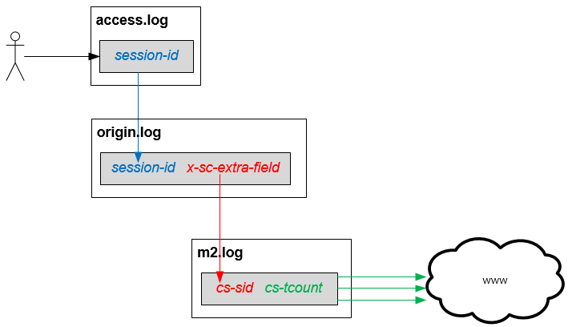

.. _op:

7장. 운영
******************

이 장에서는 운영에 필요한 다양한 도구들에 대해 설명한다.

.. _op-purge:

Caching 무효화
====================================

M2도 STON 캐싱엔진을 사용한다. 따라서 STON과 동일하게 캐싱 무효화가 가능하다. ::

   # wine (model) 변경
   http://{m2-ip}:10040/command/purge?url=example.com/myapi?model=wine&view=*

   # catalog (view) 변경
   http://{m2-ip}:10040/command/purge?url=example.com/myapi?model=*&view=catalog

모델이나 뷰가 변경되어도 TTL(Time To Live) 이후 반영된다. 
즉시 변경을 원할 경우 `Purge <https://ston.readthedocs.io/ko/latest/admin/caching_purge.html#purge>`_ 를 호출한다.

.. _op-log:

로그
====================================

M2는 3가지의 로그를 제공하며 각 로그를 연결하는 고리는 다음과 같다.

-  `access.log <https://ston.readthedocs.io/ko/latest/admin/log.html#access>`_ 

   모든 클라이언트의 HTTP 트랜잭션을 기록한다.
   
   -  ``session-id`` 클라이언트 TCP 세션이 접속할 때 부여된다.

-  `origin.log <https://ston.readthedocs.io/ko/latest/admin/log.html#origin>`_ 

   캐싱엔진에서 HIT되지 않고 M2모듈로 처리가 위임된 요청을 기록한다.

   -  ``session-id`` 원본서버(M2) 요청을 발생시킨 클라이언트 세션 ID. access.log의 ``session-id`` 와 같다.
   -  ``sc-extra-field`` M2가 진행한 트랜잭션 ID   

-  m2.log 

   M2의 각 엔드포인트에서 진행한 HTTP 트랜잭션을 개별로 진행한다. 3개의 이미지를 다운로드 받아 합성했다면 3개의 트랜잭션 로그가 남는다.   

   -  ``cs-sid`` M2가 진행한 트랜잭션 ID. origin.log의 ``session-id`` 와 같다.
   -  ``cs-tcount`` M2 트랜잭션 내에서 진행한 개별 HTTP 트랜잭션 ID. 이 값은 각 M2 트랜잭션마다 1부터 시작한다.

.. note::

   **origin.log** 라는 이름은 캐싱엔진으로부터 유래한다.
   
   -  캐싱엔진에서는 M2도 다른 웹서버와 동등한 캐싱대상이기에 원본(=origin)으로 바라볼 수 있다.
   -  클라이언트에게 노출되어 호출하는 주소와 M2엔드포인트 주소가 다를 수 있다. 이 경우 origin.log를 통해 명확히 확인할 수 있다.

.. _op-log-conf:

M2 로그 설정
------------------------------------

모든 엔드포인트의 URL 호출은 m2.log에 개별 HTTP 트랜잭션으로 기록된다. 
STON 로그 설정방식과 동일하며 가상호스트별로 설정한다. ::

   # server.xml - <Server><VHostDefault><Log>
   # vhosts.xml - <Vhosts><Vhost><Log>

   <M2 Type="time" Unit="1440" Retention="10">OFF</M2>

M2 로그 필드는 STON의 `origin 로그 <https://ston.readthedocs.io/ko/latest/admin/log.html#origin>`_ 와 동일하다.

.. _op-log-error-code:

M2 응답코드
------------------------------------

M2의 응답코드는 다음과 같다.

-  ``200`` - 성공
-  ``400`` - 클라이언트 요청 중 필수 파라미터 불충분
-  ``404`` - 클라이언트가 호출한 엔드포인트 없음
-  ``500`` - 외부자원 참조 실패
-  ``501`` - 내부모듈 실패

.. _op-log-analyze-debug-header:

디버깅 헤더
------------------------------------

M2 트랜잭션이 비정상 처리되었다면 다음 헤더를 제공한다. ::

   HTTP/1.1 500 Internal Error
   ... (생략) ...
   x-ston-sessionid: 126
   x-m2-tid: 26576nYLiaXRK
   x-m2-error-url: 400|http://foo.com/not/found
   x-m2-error-url: 404|http://bar.com/where/is/it

``wget`` 등의 커맨드를 통해 장애 범위를 좁힐 수 있다.

-  ``x-m2-tid``  M2 트랜잭션 ID

   -  origin.log의 ``sc-extra-field`` 필드 값
   -  m2.log의 ``cs-sid`` 필드 값

-  ``x-m2-error-url``
   참조시 문제가 된 원인과 URL ( ``|`` 문자로 구분)

.. _op-monitoring:

통계
====================================

`STON 가상호스트 통계 <https://ston.readthedocs.io/ko/latest/admin/monitoring_stats.html#id4>`_ 의 하위에 위치한다. ::

   "M2":                                     <M2
   {                                           Requests="30"
     "Requests": 30,                           Converted="29"
     "Converted": 29,                          Failed="1"
     "Failed": 1,                              AvgRscsSize="1457969"
     "AvgRscsSize": 1457969,                   AvgRscsCount="67"
     "AvgRscsCount": 67,                       AvgRenderTime="124" />
     "AvgRenderTime": 124,                     AvgTime="34" />
     "AvgTime": 34
   },

-  ``Requests`` M2로 요청된 횟수
-  ``Converted`` M2로 생성된 응답 (성공)
-  ``Failed`` M2에서 실패한 응답
-  ``AvgRscsSize (단위: Bytes)`` 엔드포인트에서 참조한 평균 리소스 크기
-  ``AvgRscsCount`` 엔드포인트에서 참조한 평균 리소스 카운트
-  ``AvgRenderTime (단위: ms)`` 렌더링 소요시간
-  ``AvgTime (단위: ms)`` 요청 처리시간

.. _op-vhost-volatile:

휘발성 엔드포인트
====================================

엔드포인트는 이미지/동영상에 비해 짧은 TTL(Time To Live)를 가진다. 
짧은 TTL 콘텐츠는 디스크에 캐싱해도 재사용성이 떨어져 비효율적이다. 
따라서 엔드포인트를 다루는 가상호스트는 ``Volatile (기본: OFF)`` 속성을 활성화시킨다. ::
   
   # vhosts.xml

   <Vhosts>
      <Vhost Name="www.example.com" Volatile="ON">
        ... (생략) ...
      </Vhost>

      <Vhost Name="image.example.com">
        ... (생략) ...
      </Vhost>
   </Vhosts>

`캐시 Storage <https://ston.readthedocs.io/ko/latest/admin/environment.html#storage>`_ 가 구성되어 있더라도 ``Volatile`` 가상호스트는 메모리만 사용한다.

.. _op-vhost-multi:

가상호스트 분리
====================================

엔드포인트가 이미지/동영상을 처리해야 한다면 각각 독립된 가상호스트로 구성하는 것을 권장한다. 
캐싱정책, 통계, 로그등을 분리시켜 다룰 수 있어 높은 유연성을 가지기 때문이다. ::

   # vhosts.xml

   <Vhosts>
      <Vhost Name="www.example.com" Volatile="ON">
         ... (생략) ...
         <M2>
            <Endpoints>
               ... (생략) ...
            </Endpoints>
        </M2>
      </Vhost>

      <Vhost Name="image.example.com">
        ... (생략) ...
        <Options>
           <Dims Status="Active" Keyword="dims">
              ... (생략) ...
           </Dims>
        <Options>
      </Vhost>

      <Vhost Name="video.example.com">
        ... (생략) ...
        <Media>
           ... (생략) ...
        </Media>
      </Vhost>
   </Vhosts>

만약 멀티인증서를 사용할 수 없고, 1개의 도메인으로만 통합하여 서비스해야 한다면, `URL전처리 <https://ston.readthedocs.io/ko/latest/admin/adv_vhost.html#url>`_ 를 추가한다. ::

   # vhosts.xml

   <Vhosts>
      ... (생략) ...

      <URLRewrite AccessLog="Replace">
         <Pattern><![CDATA[^www.example.com/m2/([^/]+)/(.*)]]></Pattern>
         <Replace><![CDATA[#1.example.com/#2]]></Replace>
      </URLRewrite>
   </Vhosts>

``/m2/.../{{ 원본-url }}`` 패턴을 이용해 손쉽게 구성이 가능하다.