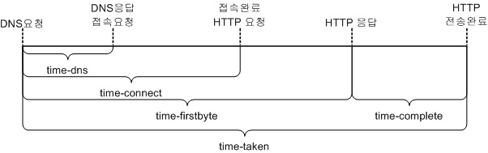

.. _op:

7장. 운영
******************

이 장에서는 운영에 필요한 다양한 도구들에 대해 설명한다.

.. _op-purge:

Caching 무효화
====================================

M2도 STON 캐싱엔진을 사용한다. 따라서 STON과 동일하게 캐싱 무효화가 가능하다. ::

   # wine (model) 변경
   http://{m2-ip}:10040/command/purge?url=example.com/myapi?model=wine&view=*

   # catalog (view) 변경
   http://{m2-ip}:10040/command/purge?url=example.com/myapi?model=*&view=catalog

모델이나 뷰가 변경되어도 TTL(Time To Live) 이후 반영된다. 
즉시 변경을 원할 경우 `Purge <https://ston.readthedocs.io/ko/latest/admin/caching_purge.html#purge>`_ 를 호출한다.

.. _op-log:

로그
====================================

M2는 3가지의 로그를 제공하며 각 로그를 연결하는 필드는 다음과 같다.

.. figure:: img/m2_33.png
   :align: center

-  `access.log <https://ston.readthedocs.io/ko/latest/admin/log.html#access>`_ 

   모든 클라이언트의 HTTP 트랜잭션을 기록한다.
   
   -  ``session-id`` 클라이언트 TCP 세션이 접속할 때 부여된다.

-  `origin.log <https://ston.readthedocs.io/ko/latest/admin/log.html#origin>`_ 

   캐싱엔진에서 HIT되지 않고 M2모듈로 처리가 위임된 요청을 기록한다. ::

       # server.xml - <Server><VHostDefault><Log>
       # vhosts.xml - <Vhosts><Vhost><Log>

       <Origin ExtraField="x-m2-tid">ON</Origin>

   위와 같이 설정하여 M2 트랜잭션 ID를 origin.log의 ``x-sc-extra-field`` 필드에 기록한다. ::

      #date      time     ...(생략)... session-id session-type x-sc-extra-field
      2020-07-20 23:42:09 ...(생략)... 166        cache        1142daVjPqz5
      2020-07-20 23:42:29 ...(생략)... 174        cache        1150S4kVS6hM

   -  ``session-id`` 원본서버(M2) 요청을 발생시킨 클라이언트 세션 ID. access.log의 ``session-id`` 와 같다.
   -  ``session-type`` 항상 ``cache`` 이다.
   -  ``x-sc-extra-field`` M2가 진행한 트랜잭션 ID (문자열)

-  m2.log 

   M2의 각 엔드포인트에서 진행한 HTTP 트랜잭션을 개별로 진행한다. 3개의 이미지를 다운로드 받아 합성했다면 3개의 트랜잭션 로그가 남는다.   

   -  ``cs-sid`` M2가 진행한 트랜잭션 ID. origin.log의 ``session-id`` 와 같다.
   -  ``cs-tcount`` M2 트랜잭션 내에서 진행한 개별 HTTP 트랜잭션 ID. 이 값은 각 M2 트랜잭션마다 1부터 시작한다.

.. note::

   **origin.log** 라는 이름은 캐싱엔진으로부터 유래한다.
   
   -  캐싱엔진에서는 M2도 다른 웹서버와 동등한 캐싱대상이기에 원본(=origin)으로 바라볼 수 있다.
   -  클라이언트에게 노출되어 호출하는 주소와 M2엔드포인트 주소가 다를 수 있다. 이 경우 origin.log를 통해 명확히 확인할 수 있다.

.. _op-log-conf:

M2 로그 설정
------------------------------------

모든 엔드포인트의 URL 호출은 m2.log에 개별 HTTP 트랜잭션으로 기록된다. 
STON 로그 설정방식과 동일하며 가상호스트별로 설정한다. ::

   # server.xml - <Server><VHostDefault><Log>
   # vhosts.xml - <Vhosts><Vhost><Log>

   <M2 Type="time" Unit="1440" Retention="10">OFF</M2>

M2 로그 필드는 STON의 `origin 로그 <https://ston.readthedocs.io/ko/latest/admin/log.html#origin>`_ 와 동일하다.

 x-sc-extra-field

.. _op-log-error-code:

M2 응답코드
------------------------------------

M2의 응답코드는 다음과 같다.

-  ``200`` - 성공
-  ``400`` - 클라이언트 요청 중 필수 파라미터 불충분
-  ``404`` - 클라이언트가 호출한 엔드포인트 없음
-  ``500`` - 외부자원 참조 실패
-  ``501`` - 내부모듈 실패

.. _op-log-analyze-debug-header:

디버깅 헤더
------------------------------------

M2 트랜잭션이 비정상 처리되었다면 다음 헤더를 제공한다. ::

   HTTP/1.1 500 Internal Error
   ... (생략) ...
   x-ston-sessionid: 126
   x-m2-tid: 26576nYLiaXRK
   x-m2-error-url: 400|http://foo.com/not/found
   x-m2-error-url: 404|http://bar.com/where/is/it

``wget`` 등의 커맨드를 통해 장애 범위를 좁힐 수 있다.

-  ``x-m2-tid``  M2 트랜잭션 ID

   -  origin.log의 ``sc-extra-field`` 필드 값
   -  m2.log의 ``cs-sid`` 필드 값

-  ``x-m2-error-url``
   참조시 문제가 된 원인과 URL ( ``|`` 문자로 구분)

.. _op-log-fields:

m2.log 파일
------------------------------------

M2가 진행하는 모든 HTTP 트랜잭션을 기록한다.
기록 시점은 HTTP 트랜잭션이 완료되는 시점이며 전송완료 또는 전송중단 시점을 의미한다. ::

   # server.xml - <Server><VHostDefault><Log>
   # vhosts.xml - <Vhosts><Vhost><Log>

   <M2 Type="time" Unit="1440" Retention="10">ON</M2>

모든 필드는 공백으로 구분되며 각 필드의 의미는 다음과 같다.

   시간측정 구간

-  ``date`` HTTP 트랜잭션이 완료된 날짜
-  ``time`` HTTP 트랜잭션이 완료된 시간
-  ``cs-sid`` 서비스 브로커(Service Broker)의 고유 ID. M2의 서비스 브로커는 내부적으로 여러 HTTP 트랜잭션을 포함한다. 서비스 브로커 ID를 통해 독립된 HTTP 트랜잭션을 연결한다.
-  ``cs-tcount`` 서비스 브로커 내의 트랜잭션 카운트. 이 HTTP 트랜잭션이 현재 서비스 브로커에서 몇 번째로 처리된 트랜잭션인지 기록한다. 같은 ``cs-sid`` 값을 가지는 트랜잭션이라면 이 값은 중복될 수 없다.
-  ``c-ip`` STON의 IP
-  ``cs-method`` 원본서버에게 보낸 HTTP Method
-  ``s-domain`` 원본서버 도메인
-  ``cs-uri`` 원본서버에게 보낸 URI
-  ``s-ip`` 원본서버 IP
-  ``sc-status`` 원본서버 HTTP 응답코드
-  ``cs-range`` 원본서버에게 보낸 Range요청 값
-  ``sc-sock-error`` 소켓 에러코드
   
   -  ``Connect-Timeout`` 연결 시간초과
   -  ``Receive-Timeout`` 수신대기 시간 초과
   -  ``Server-Close`` 원본에서의 연결종료
   -  ``Client-Close`` STON에서의 연결종료 (바이패스 중 클라이언트가 먼저 연결을 종료하는 경우)
   -  ``Non-Existent-Domain`` 연결할 Domain이 존재하지 않음

-  ``sc-http-error`` 원본서버가 4xx 또는 5xx응답을 줬을 때 응답코드를 기록
-  ``sc-content-length`` 원본서버가 보낸 Content Length
-  ``cs-requestsize (단위: Bytes)`` 원본서버로 보낸 HTTP 요청 헤더 크기
-  ``sc-responsesize (단위: Bytes)`` 원본서버가 응답한 HTTP 헤더 크기
-  ``sc-bytes (단위: Bytes)`` 수신한 컨텐츠 크기(헤더 제외)
-  ``time-taken (단위: ms)`` HTTP 트랜잭션이 완료될 때까지 소요된 전체시간. 세션 재사용이 아니라면 소켓 접속시간까지 포함한다.
-  ``time-dns (단위: ms)`` DNS쿼리에 소요된 시간
-  ``time-connect (단위: ms)`` 원본서버와 소켓 Established까지 소요된 시간
-  ``time-firstbyte (단위: ms)`` 요청을 보내고 응답이 올때까지 소요된 시간
-  ``time-complete (단위: ms)`` 첫 응답부터 완료될 때까지 소요된 시간
-  ``cs-reqinfo`` 부가 정보. "+"문자로 구분한다. 바이패스한 통신이라면 "Bypass", Private바이패스라면 "PrivateBypass"로 기록된다.
-  ``cs-acceptencoding`` 원본서버에 압축된 컨텐츠를 요청하면 "gzip+deflate"로 기록된다.
-  ``sc-cachecontrol`` 원본서버가 보낸 cache-control헤더
-  ``s-port`` 원본서버 포트
-  ``sc-contentencoding`` 원본서버가 보낸 Content-Encoding헤더
-  ``session-id`` 원본서버 요청을 발생시킨 HTTP 클라이언트 세션 ID (unsigned int64)
-  ``session-type`` 원본서버에 요청한 세션 타입

   -  ``ref`` 리소스 참조

-  ``m2x-engine`` 콘텐츠 처리에 사용된 M2 엔진의 처리로그로 QueryString 형식으로 기록된다.

   -  :ref:`engine-prditem-mixed-log`

.. _op-log-backup:

실시간 로그백업
=================================================

M2는 실시간으로 적재되는 로그를 S3등 오브젝트 스토리지로 백업할 수 있다. ::

   # /usr/local/m2/conf/config.json

   {
     "m2": {
       "backup": {
         "enable": false,
         "repository": [
           {
             "name": "backup",
             "type": "aws-s3",
             "rolling": "0 0",
             "path": "/edgelog/{domain}/{timestamp}/{hostname}_{logtype}.log",
             "compression": {
               "enable": false
             },
             "endpoint": {
               "bucket": "s3-backup",
               "region": "ap-northeast-2",
               "accessKey": "AKKKUPB5555557S4RTTT",
               "secretKey": "cqavykf6lPMc4KaJ6mETMQQQQQQLBmj4LWKiejq"
             }
           }
         ],
         "source": [
           {
             "path": "/ston_log/foo.com/access.log",
             "backup": "backup"
           }
         ]
       }
     }
   }

-  ``enable (기본: false)`` 로그백업 활성화
  
   .. note:: 
  
      로그 백업 때문에 서비스 성능저하가 발생하면 안되어 스펙만 존재, 구현하지 않는다.
     

-  ``repository`` 로그 저장소 목록

   - ``name`` 저장소 이름. 중복불가.
   - ``type`` 저장소 타입. 현재는 ``aws-s3`` 만 지원한다.
   - ``rolling`` 로그 업로드 시점

     .. note::

        개별 로그의 ``rolling`` 설정과 같은 표현을 사용하지만 동작방식이 다르다.

          -  개별로그의 ``rolling`` 은 물리적인 로컬 로그파일이 교체되는 것에 대해 정의한다.
          -  로그백업의 ``rolling`` 은 저장소에 저장될 로그파일 단위에 대해 정의한다.

        예를 들어 로컬의 access.log는 day 단위로 운영되더라도 서버 사이드 백업은 5분 단위로 백업될 수 있다.
        그 반대도 가능하다.

     .. hint::

        rt가 생성하는 물리적으로 분절된 파일의 연관성을 core에서 알 수 없어 이에 대한 지원이 필요하다.

        - 1안> rt의 로그 순서 api 지원
        - 2안> 로그 파일에 확장속성 ``xattr`` 을 이용해 OS상에서 linked list처럼 구현

   - ``path`` 로그 업로드 경로정책. 경로 정책은 다음 3요소를 고려하여 구성되어야 한다.

     -  ``멀티 노드`` 2대 이상의 불특정 멀티 노드에서 운영된다.
     -  ``멀티 가상호스트`` 2개 이상의 가상호스트가 존재하며 언제든지 추가/삭제된다.
     -  ``시간`` 로그는 시계열 데이터이다.
    
     로그 백업시 경로충돌에 대해 보장하지 않는다.

     이상을 지원하기 위해 다음 변수를 제공한다.

     ==================== ========================================================
     ``{변수}``               상세
     ==================== ========================================================
     ``{domain}``          가상호스트 이름
     ``{hostname}``        가상호스트를 서비스하는 M2의 호스트명
     ``{ip}``              M2노드의 IP
     ``{timestamp}``       ``yyyymmddhhmmss`` 형식의 시간
     ``{logtype}``         로그타입. ``access`` 또는  ``origin`` 
     ==================== ========================================================

     ``{timestamp}`` 의 경우 하위 필드를 제공한다.

     ====================== ========================================================
     ``{timestamp}``          20220116173627
     ====================== ========================================================
     ``{timestamp.date}``      20220116
     ``{timestamp.time}``      173627
     ``{timestamp.year}``      2022
     ``{timestamp.month}``     01
     ``{timestamp.day}``       16
     ``{timestamp.hour}``      17
     ``{timestamp.minute}``    36
     ``{timestamp.second}``    27  
     ====================== ========================================================

   - ``compression`` 로그 gzip 압축.

   - ``endpoint`` 저장소 연결구성
     - ``bucket`` 버킷
     - ``region`` 리젼
     - ``accessKey`` 액세스 키
     - ``secretKey`` 시크릿 키

- ``source`` 백업할 로컬로그 목록

  - ``path`` 로컬로그 경로
  - ``backup`` 백업할 ``repository.name``

S3 + Athena 가이드
---------------------------

S3 + Athena를 이용하면 매우 효과적인 분석도구를 손쉽게 구축할 수 있다.
단, Athena는 스캔한 데이터 용량기반 과금체계를 가지기에 적절한 파티셔닝 전략이 필요하다.

::

   # /usr/local/m2/conf/config.json

   {
     "m2": {
       "backup": {
         "enable": true,
         "repository": [
           {
             ...
             "path": "/mypath/year={timestamp.year}/month={timestamp.month}/day={timestamp.day}/hour={timestamp.hour}/min={timestamp.minute}/type={logtype}/domain={domain}/{hostname}_{ip}_{timestamp}.log"
              "rolling": "*/5 *",
              "compression": {
                "enable": true
              },
              ...
           }
         ]
       }
     }
   }

-  ``path`` 파티셔닝 전략은 ``path`` 의 {key=value} 형식을 통해 로그분석 목적을 분명히 한다. ::

      /...시간.../type=access/
      지난 1주일 Peak시간 동안 클라이언트가 접근한 파일 중 10MB이상의 개수를 분석한다.

      /...시간.../type=origin/domain=foo.com/
      어제 오후 4시부터 15동안 foo.com 원본에서 발생한 500 에러 응답을 분석한다. 

-  ``rolling`` 최소 단위로 5분을 권장한다.

-  ``compression.enble`` 압축을 통해 90% 이상 비용을 절감할 수 있다.

``athena`` access.log 테이블 스키마
------------------------------------

::

   CREATE EXTERNAL TABLE IF NOT EXISTS access_logs (
      `date` STRING,
      `time` STRING,
      `s-ip` STRING,
      `cs-method` STRING,
      `cs-uri-stem` STRING,
      `cs-uri-query` STRING,
      `s-port` STRING,
      `cs-username` STRING,
      `c-ip` STRING,
      `cs-useragent` STRING,
      `sc-status` STRING,
      `sc-bytes` STRING,
      `time-taken` STRING,
      `cs-referer` STRING,
      `sc-resinfo` STRING,
      `cs-range` STRING,
      `sc-cachehit` STRING,
      `cs-acceptencoding` STRING,
      `session-id` STRING,
      `sc-content-length` STRING,
      `time-response` STRING,
      `x-transaction-status` STRING,
      `x-vhostlink` STRING 
   ) PARTITIONED BY (`year` int, `month` int, `day` int)
   ROW FORMAT SERDE 'org.apache.hadoop.hive.serde2.RegexSerDe'
   WITH SERDEPROPERTIES (
      "input.regex" = "^(?!#)([^ ]+)\\s+([^ ]+)\\s+([^ ]+)\\s+([^ ]+)\\s+([^ ]+)\\s+([^ ]+)\\s+([^ ]+)\\s+([^ ]+)\\s+([^ ]+)\\s+([^ ]+)\\s+([^ ]+)\\s+([^ ]+)\\s+([^ ]+)\\s+([^ ]+)\\s+([^ ]+)\\s+([^ ]+)\\s+([^ ]+)\\s+([^ ]+)\\s+([^ ]+)\\s+([^ ]+)\\s+([^ ]+)\\s+([^ ]+)\\s+([^ ]+)"
   ) LOCATION "s3://winesoft-logs/access"
   TBLPROPERTIES ("has_encrypted_data"="false");

``athena`` origin.log 테이블 스키마
------------------------------------

::

   CREATE EXTERNAL TABLE IF NOT EXISTS origin_logs (
      `date` STRING,
      `time` STRING,
      `cs-sid` STRING,
      `cs-tcount` STRING,
      `c-ip` STRING,
      `cs-method` STRING,
      `s-domain` STRING,
      `cs-uri` STRING,
      `s-ip` STRING,
      `sc-status` STRING,
      `cs-range` STRING,
      `sc-sock-error` STRING,
      `sc-http-error` STRING,
      `sc-content-length` STRING,
      `cs-requestsize` STRING,
      `sc-responsesize` STRING,
      `sc-bytes` STRING,
      `time-taken` STRING,
      `time-dns` STRING,
      `time-connect` STRING,
      `time-firstbyte` STRING,
      `time-complete` STRING,
      `cs-reqinfo` STRING,
      `cs-acceptencoding` STRING,
      `sc-cachecontrol` STRING,
      `s-port` STRING,
      `sc-contentencoding` STRING,
      `session-id` STRING,
      `session-type` STRING,
      `x-sc-extra-field` STRING,
      `time-sock-creation` STRING,
      `x-cs-retry` STRING
   ) PARTITIONED BY (`year` int, `month` int, `day` int)
   ROW FORMAT SERDE 'org.apache.hadoop.hive.serde2.RegexSerDe'
   WITH SERDEPROPERTIES (
      "input.regex" = "^(?!#)([^ ]+)\\s+([^ ]+)\\s+([^ ]+)\\s+([^ ]+)\\s+([^ ]+)\\s+([^ ]+)\\s+([^ ]+)\\s+([^ ]+)\\s+([^ ]+)\\s+([^ ]+)\\s+([^ ]+)\\s+([^ ]+)\\s+([^ ]+)\\s+([^ ]+)\\s+([^ ]+)\\s+([^ ]+)\\s+([^ ]+)\\s+([^ ]+)\\s+([^ ]+)\\s+([^ ]+)\\s+([^ ]+)\\s+([^ ]+)\\s+([^ ]+)\\s+([^ ]+)\\s+([^ ]+)\\s+([^ ]+)\\s+([^ ]+)\\s+([^ ]+)\\s+([^ ]+)\\s+([^ ]+)\\s+([^ ]+)\\s+([^ ]+)"
   ) 
   LOCATION "s3://winesoft-logs/origin"
   TBLPROPERTIES ("has_encrypted_data"="false");

.. _op-monitoring:

통계
====================================

`STON 가상호스트 통계 <https://ston.readthedocs.io/ko/latest/admin/monitoring_stats.html#id4>`_ 의 하위에 위치한다. ::

   "M2":                                     <M2
   {                                           Requests="30"
     "Requests": 30,                           Converted="29"
     "Converted": 29,                          Failed="1"
     "Failed": 1,                              AvgRscsSize="1457969"
     "AvgRscsSize": 1457969,                   AvgRscsCount="67"
     "AvgRscsCount": 67,                       AvgRenderTime="124" />
     "AvgRenderTime": 124,                     AvgTime="34" />
     "AvgTime": 34
   },

-  ``Requests`` M2로 요청된 횟수
-  ``Converted`` M2로 생성된 응답 (성공)
-  ``Failed`` M2에서 실패한 응답
-  ``AvgRscsSize (단위: Bytes)`` 엔드포인트에서 참조한 평균 리소스 크기
-  ``AvgRscsCount`` 엔드포인트에서 참조한 평균 리소스 카운트
-  ``AvgRenderTime (단위: ms)`` 렌더링 소요시간
-  ``AvgTime (단위: ms)`` 요청 처리시간

.. _op-vhost-volatile:

휘발성 엔드포인트
====================================

엔드포인트는 이미지/동영상에 비해 짧은 TTL(Time To Live)를 가진다. 
짧은 TTL 콘텐츠는 디스크에 캐싱해도 재사용성이 떨어져 비효율적이다. 
따라서 엔드포인트를 다루는 가상호스트는 ``Volatile (기본: OFF)`` 속성을 활성화시킨다. ::
   
   # vhosts.xml

   <Vhosts>
      <Vhost Name="www.example.com" Volatile="ON">
        ... (생략) ...
      </Vhost>

      <Vhost Name="image.example.com">
        ... (생략) ...
      </Vhost>
   </Vhosts>

`캐시 Storage <https://ston.readthedocs.io/ko/latest/admin/environment.html#storage>`_ 가 구성되어 있더라도 ``Volatile`` 가상호스트는 메모리만 사용한다.

.. _op-vhost-multi:

가상호스트 분리
====================================

엔드포인트가 이미지/동영상을 처리해야 한다면 각각 독립된 가상호스트로 구성하는 것을 권장한다. 
캐싱정책, 통계, 로그등을 분리시켜 다룰 수 있어 높은 유연성을 가지기 때문이다. ::

   # vhosts.xml

   <Vhosts>
      <Vhost Name="www.example.com" Volatile="ON">
         ... (생략) ...
         <M2>
            <Endpoints>
               ... (생략) ...
            </Endpoints>
        </M2>
      </Vhost>

      <Vhost Name="image.example.com">
        ... (생략) ...
        <Options>
           <Dims Status="Active" Keyword="dims">
              ... (생략) ...
           </Dims>
        <Options>
      </Vhost>

      <Vhost Name="video.example.com">
        ... (생략) ...
        <Media>
           ... (생략) ...
        </Media>
      </Vhost>
   </Vhosts>

만약 멀티인증서를 사용할 수 없고, 1개의 도메인으로만 통합하여 서비스해야 한다면, `URL전처리 <https://ston.readthedocs.io/ko/latest/admin/adv_vhost.html#url>`_ 를 추가한다. ::

   # vhosts.xml

   <Vhosts>
      ... (생략) ...

      <URLRewrite AccessLog="Replace">
         <Pattern><![CDATA[^www.example.com/m2/([^/]+)/(.*)]]></Pattern>
         <Replace><![CDATA[#1.example.com/#2]]></Replace>
      </URLRewrite>
   </Vhosts>

``/m2/.../{{ 원본-url }}`` 패턴을 이용해 손쉽게 구성이 가능하다.

.. _op-conf-sync:

설정 동기화
====================================

``M2`` 는 stand-alone을 기본 모드로 동작하지만 공용 저장소를 이용해 설정을 동기화할 수 있다. ::

   # config.json

   {
      "m2": {
         "config": {
            "sync": {
               "type": "aws-s3",
               "polling": "0 0 * * * *",
               "retention": 100,
               "endpoint": {
                  "bucket": "...",
                  "region": "...",
                  "path"": "...",
                  "accessKey": "...",
                  "secretKey": "..."
               }
            }
         }
      }
   }

``type`` 의 저장소를 ``polling`` 주기동안 폴링하여 설정변경을 감지한다.