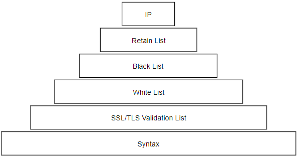

.. _engine-prditem:

13장. 상품기술서 엔진
******************

상품기술서 엔진은 도큐먼트 엔진에서 파생된, E-Commerce 상품기술서에 특화된 엔진이다. 
이 엔진을 통해 Mixed Contents 이슈 등 셀 수 없이 많은 상품기술서를 즉시 개선할 수 있다.

설정 구조는 다음과 같다. ::

   # /usr/local/m2/config-production.json

   {
      "m2": {
         "mixed" : {
            ...
         }
      }
   }


.. toctree::
   :maxdepth: 2


.. _engine-prditem-mixed-contents-traffic:

상품기술서 트래픽 라우팅
====================================


.. _engine-prditem-mixed-traffic:

Mixed Contents 트래픽 상세
====================================

처리의 종류 ::

   // -> https://
   http:// -> https://
   onloading
   https:// 그대로


/m2x/main
---------------------

/m2x/rebound
---------------------

/m2x/resource
---------------------

리소스 트래픽의 대부분은 이미지이다. 
이미지 서비스는 CDN 서비스를 이용하는 경우가 많아 다음과 같이 별도의 도메인 지정이 가능하다. ::

   # m2.mixed

   "traffics" : {
      "resource" : {
         "domain" : null
      }
   }


메인, 리바운드 트래픽은 가상호스트 이름을 따른다. 하지만 리소스의 경우 설정에 따라 변경된다. ::

   // 메인, 리바운드 트래픽
   https://example.com/products/100/m2x/mixed/main
   https://example.com/products/100/m2x/mixed/rebound/...

   // { "domain" : null } 이라면 가상호스트 이름과 같다.
   https://example.com/products/100/m2x/mixed/resource/...

   // { "domain" : "cdn.example.com" } 이라면 해당 도메인명을 사용한다.
   https://cdn.example.com/products/100/m2x/mixed/resource/...
   


예외 트래픽
---------------------

간혹 서비스간의 연계나 너무 잦은 요청으로 인해 호출되는 도메인에서 서비스를 거부할 수 있다. 
이 경우 플랜A M2는 실패할 수 있지만, 클라이언트가 실패했다고 확신할수 없다. 


.. _engine-prditem-mixed-contents:

Mixed Contents 처리
====================================

Mixed Contents 엔진의 목적은 최소한의 ``URL`` 에 대해 SSL Onloading 을 적용하는 것이다.
아래와 같이 5단계의 정책 우선순위로 SSL Onloading 이 결정된다.




*  ``IP`` IP 주소는 인증서를 탑재할 수 없다. SSL Onloading 한다.
*  ``Remain List`` 등록된 도메인은 처리하지 않는다.
*  ``Black List`` 등록된 도메인은 강제로 SSL Onloading 시킨다.
*  ``White List`` 등록된 도메인은 ``https://`` 프로토콜만 명시한다.
*  ``SVL (SSL/TLS Validation List)`` m2live 서비스 데이터베이스를 참고하여 결정한다.
*  ``Syntax`` HTML 문법만으로 판단한다. ``http://`` 프로토콜 Scheme이 명시된 경우에만 SSL Onloading 한다.


상품기술서 처리에 앞서 대상을 지정한다. ::

   # m2.mixed

   "options" : {
      "anchor" : false,
      "schemeless" : false,
   }


-  ``options`` 엔진 수행옵션을 설정한다.

   -  ``anchor (기본: false)`` 이 값을 ``true`` 로 설정하면 ``<a href="http://...">`` 의 프로토콜을 Mixed Contents 정책에 따라 수정한다. ::
      
         // AS-IS
         <a href="http://foo.com/index.html">

         // TO-BE
         <a href="https://foo.com/index.html">

      링크는 proxying 될 경우 정상동작을 보장할 수 없기 프로토콜만을 수정한다.

   -  ``schemeless (기본: false)`` 이 값을 ``true`` 로 설정하면 scheme이 생략된 URL에 https를 추가한다. ::

         // AS-IS
         <script src="//foo.com/common.js">

         // TO-BE
         <script src="http://foo.com/common.js">


.. _engine-prditem-mixed-contents-ip:

IP 정책
---------------------

상품기술서 내에 IP를 포함하는 ``URL`` 을 처리한다. ::

   
   

위 태그는 다음과 같이 변환된다. ::

   
   ">


SSL Onloading 여부를 설정할 수 있다. ::

   # m2.mixed

   "upgradeHttps" : {
      "ip" : {
         "proxy" : true
      }
   }

-  ``proxy``

   -  ``true (기본)`` IP를 SSL Onloading한다.
   -  ``false`` IP를 처리하지 않는다.


.. _engine-prditem-mixed-contents-remainlist:

Remain List
---------------------

Remain List(유지목록)에 등록된 도메인에 대해서는 어떠한 처리도 수행하지 않는다. ::

   # m2.mixed

   "upgradeHttps" : {
      "retain" : {
         "enable" : true,
         "list" : []
      }
   }


-  ``retain`` 유지목록을 설정한다.

   -  ``enable``
      -  ``true (기본)`` 유지목록을 활성화한다.
      -  ``false`` 유지목록을 비활성화한다.

   -  ``list`` 수정하지 않을 도메인 리스트


HTTPS를 지원하지 않는 foo.com을 예로 들어보자. ::

   


정상적인 경우 위 URL은 다음과 같이 SSL Onloading된다. ::

   


하지만 유지목록이 다음과 같이 활성화되어 있다면 원본 태그인 ```` 를 그대로 유지한다. ::

   "upgradeHttps" : {
      "retain" : {
         "enable" : true,
         "list" : ["foo.com"]
      }
   }


.. note::

   유지목록은 백엔드에서 통제되는 도메인에 한정하여, 개발 또는 디버깅 용도로 사용하는 것이 바람직하다.   


Black List
---------------------

``Black List`` 에 등록되어 있다면 무조건 SSL Onloading 시킨다. ::

   "upgradeHttps" : {
      "black" : {
         "enable" : true,
         "list" : []
      }
   }

이 기능은 보다 명확하게 동작한다는 이유에서 ``White List`` 보다 우선한다. ::

   // 원본 태그
   

   // "list" : [] 인 경우라면 수정하지 않는다.
   

   // "list" : ["foo.com"] 인 경우라면 SSL onloading 시킨다.
   


White List
---------------------

``White List`` 에는 명확히 https를 지원하는 도메인을 등록한다. ::

   "upgradeHttps" : {
      "white" : {
         "enable" : true,
         "list" : []
      }
   }


``Retain List`` 는 수정이 없는 반면 ``White List`` 는 해당 도메인이 ``https`` 를 지원할 것으로 기대한다는 차이점이 있다. ::

   // 원본 태그
   

   // "list" : [] 인 경우라면 SSL onloading 시킨다.
   

   // "list" : ["foo.com"] 인 경우라면 foo.com이 https를 지원한다고 간주하여 프로토콜만 변경한다.
   
  


SVL-DB
---------------------

.. note::

   개념과 동작상세에 대해서는 `SVL 연동 시나리오`_ 를 참고한다.


SVL-DB를 연동하는 방식에 대해 설정한다. ::

   "upgradeHttps" : {
      "svldb" : {
         "url" : "https://svl.m2live.co.kr",
         "enable" : true,
         "report": {
            "enable": true,
            "schedule": "0 0 * * * *"
         },
         "update": {
            "enable": true,
            "schedule": "0 0 * * * *"
         }
      }
   }


-  ``svldb`` SVL-DB 사용여부를 설정한다.

   -  ``url (기본: "https://svl.m2live.co.kr")`` SVL 서비스와 통신할 URL을 설정한다. M2에서 외부 통신이 불가능할 경우 Proxy주소를 통해 통신이 가능하다.
   
   -  ``enable``

      -  ``true (기본)`` SVL-DB를 사용하여 URL을 처리한다.
      -  ``false`` SVL-DB를 사용하지 않는다.

   -  ``report`` 상품기술서 내 불확실한 도메인 목록을 SVL 서비스로 보고한다.
   -  ``update`` SVL-DB를 업데이트한다.


``report`` , ``update`` 의 하위 설정인 ``schedule`` 은 `cron <https://ko.wikipedia.org/wiki/Cron>`_ 표현을 사용한다. 
1시간마다 도메인 목록을 보고하며 SVL-DB를 업데이트한다. 


다음과 같이 도메인에 대한 http, https 서비스가 불안정한 상태를 예로 들어보자.

.. figure:: img/prditem02.png
   :align: center

엔진은 SVL-DB를 참고하여 다음 태그를 수정한다. ::

   
   
   
   


위 태그는 순서대로 다음과 같이 수정된다. ::

      // http -> https
      // do nothing
     // proxy + (http -> https)
     // proxy

         


Syntax
---------------------

URL 형식만 보고 문법적으로 판단한다. ::

   "upgradeHttps" : {
      "syntax" : {
         "enable" : true
      }
   }

-  ``syntax`` 프로토콜만으로 판단한다.

   -  ``enable``
      -  ``true (기본)`` http:// 로 시작되는 URL만 SSL Onloading한다.
      -  ``false`` 아무 것도 하지 않는다.


.. note::

   scheme이 생략된 URL(예. src="//foo.com/")은 HTTP 트랜잭션이 진행된 프로토콜을 따른다는 의미이기 때문에 처리하지 않는다.


.. _engine-prditem-svl-details:

SVL 연동 시나리오
====================================

SVL(SSL/TLS Validation List) 의 개념과 시나리오에 대해 설명한다.