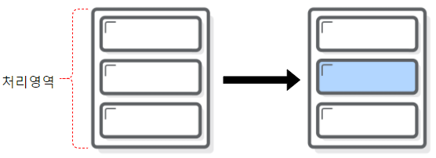
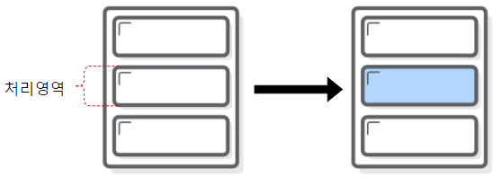
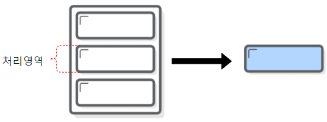
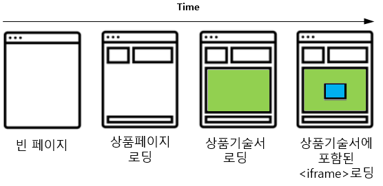
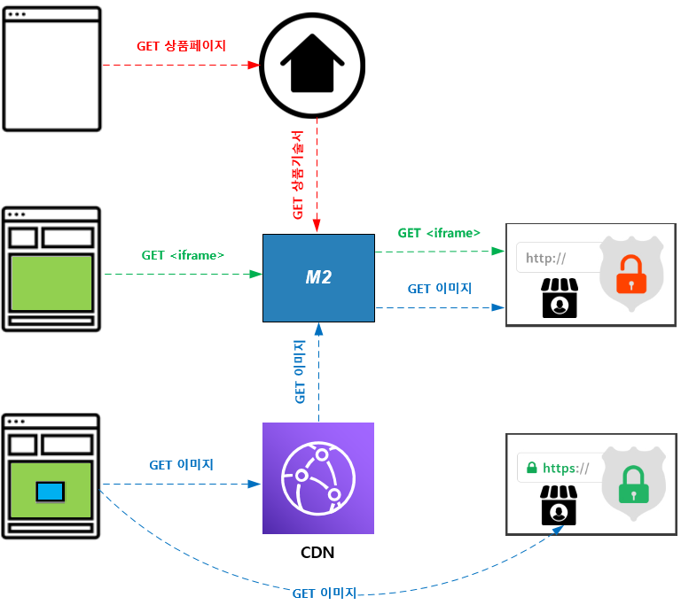
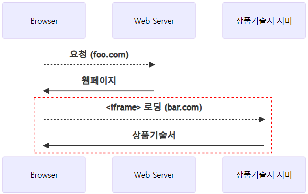
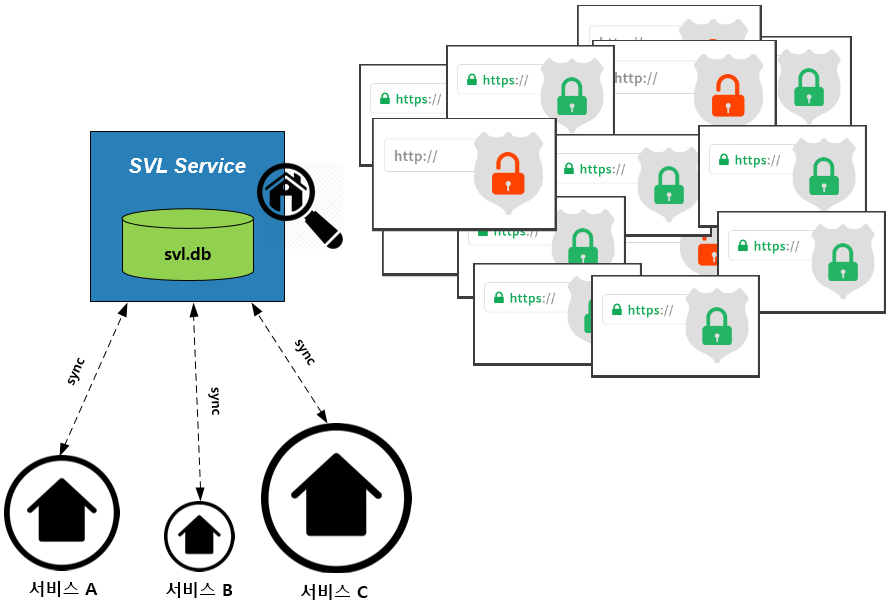

.. _engine-prditem:

13장. 상품기술서 엔진
******************

상품기술서 엔진은 도큐먼트 엔진으로부터 진화된 E-Commerce 상품기술서 처리에 특화된 엔진이다. 

.. toctree::
   :maxdepth: 2 


.. _engine-prditem-area:

상품기술서 처리영역 지정
====================================

상품기술서는 완전한 형태의 ``<HTML>`` 로 존재하는 경우가 많다.
의사가 수술부위를 명확히 지정하는 것처럼 URL 규칙으로 상품기술서 처리영역을 설정할 수 있다.


위 그림과 같이 파란영역이 수정범위인 경우를 예로 들어 설명한다.


미지정
---------------------

별도의 영역 지정자를 설정하지 않는다. ::

   https://.../m2x/mixed/main


전체 페이지를 대상으로 상품기술서가 수정된다.




영역 선택
---------------------

``:`` 구분자로 처리할 영역을 `CSS Selector <https://www.w3schools.com/cssref/css_selectors.asp>`_ 로 선택한다. ::

   https://.../m2x/mixed/main:selector

   // #id 표현은 :id로 표기된다.
   https://.../m2x/mixed/main::id


``contents`` 영역만을 대상으로 상품기술서가 수정되며, 그 외에는 수정하지 않는다.




영역 추출
---------------------

``!`` 구분자로 추출할 영역을 `CSS Selector <https://www.w3schools.com/cssref/css_selectors.asp>`_ 로 선택한다. ::

   https://.../m2x/mixed/main:selector

   // #id 표현은 :id로 표기된다.
   https://.../m2x/mixed/main::id


``contents`` 영역만을 추출하여 상품기술서가 수정되며 응답한다.




.. _engine-prditem-area-json:

JSON
---------------------

상품기술서 ``<HTML>`` 이 ``JSON`` 내부에 저장된 경우, JSON 노드표현이 가능하다. ::

   {
      "data": {
         "goodsItem": {
            "desc": ""
         }
      }
   }

단, 이 경우는 본문이 ``JSON`` 이기 때문에 ``/mainjson`` 키워드를 사용한다. ::

   https://.../m2x/mixed/mainjson:data.goodsItem.desc
   https://.../m2x/mixed/mainjson!data.goodsItem.desc


.. _engine-prditem-mixed-contents-traffic:

상품기술서 트래픽 상세
====================================

상품기술서를 웹 페이지에 포함시키는 패턴은 3가지가 존재한다. 

-  웹페이지 Embed
-  독립 도메인 ``추천``
-  통합 도메인


각 구조별로 상품 페이지를 완성하기까지의 과정을 단계별로 알아본다.




웹페이지 Embed
---------------------

웹 페이지를 응답하기 전 서버 사이드에서 상품기술서를 포함(Embed)시킨 후 완성된 웹 페이지를 응답한다. 
브라우저는 상품기술서 서버의 존재를 알 수 없다.


이 구조에서는 M2가 <상품기술서 서버> 를 대신하여 트래픽을 처리한다. 
<Web Server>가 보내는 요청이 <M2>로 유입되도록 “domain, ip, hosts 파일” 등을 변경한다.


<Web Server>는 기존과 동일한 방식으로 웹 페이지에 상품기술서를 삽입한다.




1.  ``메인 트래픽(Red)`` 브라우저가 상품페이지를 <Web Server>로 요청한다.
    <Web Server>는 <M2> 로부터 "수정된" 상품기술서를 받아 웹페이지에 삽입한다.

2.  ``리바운드 트래픽(Green)`` 브라우저는 상품기술서 안에서 참조하는 document( ``css`` , ``js`` , ``<iframe>`` 등)를 <M2> 로 요청한다.

3.  ``리소스 트래픽(Blue)`` 브라우저는 상품기술서 안에서 참조하는 이미지를 <CDN> 또는 <HTTPS를 지원하는 셀러 사이트>로 요청한다.
    <CDN>은 <M2> 를 원본서버로 바라본다.


.. note::

   신규 도메인

   -  ``m2cdn.example.com`` 상품기술서에서 파생된 리소스 트래픽을 <CDN>에 위임하는 용도


독립 도메인
---------------------

상품기술서를 ``<iframe>`` 또는 AJAX 를 이용해 브라우저에서 로딩한다. 
상품기술서 서버가 완전히 독립된 도메인으로 운영된다.



이 구조에서는 <상품기술서 서버>의 도메인을 M2로 위임하는 것만으로 구성이 가능하다. 
위 그림의 빨간 점선 트래픽이 다음과 같이 변경된다.


상품기술서가 포함하는 ``<iframe>`` 이 내부적으로 다른 ``<iframe>`` 을 포함하여도 트래픽이 <M2>로 자연스럽게 유입된다.


0.  브라우저는 <Web Server>로부터 상품페이지를 로딩한다.

1.  ``메인 트래픽(Red)`` <M2>는 <Web Server>와 독립된 도메인으로 서비스된다.
    브라우저가 "수정된" 상품기술서를 <M2> 로부터 로딩한다.

2.  ``리바운드 트래픽(Green)`` 브라우저는 상품기술서 안에서 참조하는 document( ``css`` , ``js`` , ``<iframe>`` 등)를 <M2> 로 요청한다.

3.  ``리소스 트래픽(Blue)`` 브라우저는 상품기술서 안에서 참조하는 이미지를 <CDN> 또는 <HTTPS를 지원하는 셀러 사이트>로 요청한다.
    <CDN>은 <M2> 를 원본서버로 바라본다.


.. note::

   신규 도메인
   
   -  ``m2.example.com`` 상품기술서 메인/리바운드 트래픽을 <M2>로 라우팅 시키는 용도
   -  ``m2cdn.example.com`` 상품기술서에서 파생된 리소스 트래픽을 <CDN>에 위임하는 용도

   만약 상품기술서 트래픽 전부를 CDN에 위임한다면 1개의 도메인으로 서비스가 가능하다.


통합 도메인
---------------------

`독립 도메인`_ 과 같은 방식이나 Top-level 페이지(보통 www 도메인)와 같은 도메인을 사용한다.


이 구조는 흔히 <프론트 캐시> 로 알려져있다. 
M2의 URL 전처리 기능을 이용해 상품기술서 트래픽을 정확히 분리시켜야 한다. 

도입 전 반드시 다음과 같이 처리할 상품기술서 URL 패턴이 확정되어야 한다.


또는 <Web Server>가 상품기술서 트래픽만을 분리하여 <M2>로 위임하는 방식도 가능하지만 매우 위험하다. 
왜냐하면 <M2>는 상품기술서를 찾기 위해 다시 <Web Server>로 요청하게 되어 트래픽 Loop가 발생할 수 있기 때문이다.


0.  브라우저는 <Web Server>로부터 상품페이지를 로딩한다. <M2>는 바이패스할 뿐 관여하지 않는다.

1.  ``메인 트래픽(Red)``  <M2>는 <Web Server>와 동일한 도메인으로 서비스된다.
    브라우저가 "수정된" 상품기술서를 <M2> 로부터 로딩한다.

2.  ``리바운드 트래픽(Green)`` 브라우저는 상품기술서 안에서 참조하는 document( ``css`` , ``js`` , ``<iframe>`` 등)를 <M2> 로 요청한다.

3.  ``리소스 트래픽(Blue)`` 브라우저는 상품기술서 안에서 참조하는 이미지를 <CDN> 또는 <HTTPS를 지원하는 셀러 사이트>로 요청한다.
    <CDN>은 <M2> 를 원본서버로 바라본다.


.. note::

   신규 도메인

   -  ``m2cdn.example.com`` 상품기술서에서 파생된 리소스 트래픽을 <CDN>에 위임하는 용도


독립 도메인 추천 이유
---------------------

`독립 도메인`_ 방식을 속도와 안정성 면에서 추천한다.

-  `웹페이지 Embed`_ 방식과 비교

   - 상품기술서를 웹 페이지에 삽입하는 시간만큼 ``TTFB(Time To First Byte)`` 가 줄어든다.
   - <브라우저>는 전달받은 Top-level 페이지를 먼저 화면에 표기한다. 체감 속도가 빨라진다.
   - 만약의 상품기술서 장애상황에도 핵심정보인 가격, 결제 등이 영향받지 않는다.

-  `통합 도메인`_ 방식과 비교
   - 모든 트래픽이 M2를 거친다. 1-hop의 증가로 인한 속도저하는 미비하나 프론트 캐시용도로 사용하지 않는다면 효용성이 높다고 보기 어렵다.
   - 웹 페이지 장애시 점검 범위가 M2까지로 확대된다.
   - 상품기술서 패턴이 늘어날 때마다 M2에 추가해 주어야 한다.


.. note::

   운영 편의성 측면에서도 <2. 독립 도메인> 방식이 강점을 가진다.

   -  상품기술서와 부가 트래픽( ``<iframe>`` , http 이미지 등)을 분리해 정확히 모니터링/관리할 수 있다. 분리되어 있지 않다면 로그를 분석해야 한다.
   -  상품기술서 트래픽을 손쉽게 CDN으로 위임할 수 있다.
   -  상품기술서 정책이 수정되더라도 다른 백엔드 자원에 영향을 주지 않는다.
   -  상품기술서 도메인을 <Web Server>로 위임하여 기존 구조로 쉽게 롤백할 수 있다.


.. _engine-prditem-mixed-traffic:

Mixed Contents - 트래픽 라우팅
====================================

`Mixed Contents <https://csp-kr.readthedocs.io/ko/latest/patterns/pattern_webpage.html#mixed-contents>`_ 로 차단될 콘텐츠를 가장 안전하게 전송하는 방법은 SSL Onloading 이다.
백엔드로 추가되는 트래픽의 종류와 처리방식에 대해 상세히 설명한다.


메인 트래픽 ``/m2x/mixed/main``
---------------------

상품기술서 ``<HTML>`` 을 전송하는 트래픽이다. 
상품기술서에 대한 접근이 발생하는 위치에 따라 흐름이 달라진다.
호출 방식에 따라 앞서 언급한 3가지로 구분된다.


-  `웹페이지 Embed`_
-  `독립 도메인`_
-  `통합 도메인`_


리바운드 트래픽 ``/m2x/mixed/rebound``
---------------------
웹 페이지는 구조적으로 다른 문서를 포함(Embed)할 수 있다. 


따라서 메인 트래픽으로 기존 상품기술서를 처리하였어도, 다음처럼 ``<iframe>`` 으로 참조되는 페이지까지는 처리할 수 없다. ::

   <iframe src="http://foo.com/..."></iframe>

예제의 ``http://foo.com`` 에 Mixed-Contents 문제여부는 태그만으로 알 수 없다. 
따라서 클라이언트에게 직접 노출시키는 것은 위험하다. 

M2는 메인 트래픽이 ``https://example.com/product/100`` 에 의해 접근되었다면 다음과 같이 소스를 수정한다. ::

   <iframe src="https://example.com/product/100/m2x/mixed/rebound/http://foo.com/..."></iframe>

Browser에서 상품기술서가 로딩 된 이후에 발생하는 리바운드 트래픽은 다음처럼 진행된다.


.. note::

   리바운드 트래픽을 위한 URL변조 규칙이 Suffix인 이유는 반드시 메인 트래픽과 같은 흐름을 이용해야 하기 때문이다.

      1. Browser에서 ``https://example.com/product/100`` 를 요청한다.
      2. ``/product/100`` 에 대한 요청이 M2로 도달하고 상품기술서가 제공된다. (메인 트래픽)
      3. Browser는 상품기술서 안의 <iframe>의 src를 호출한다.

   
   여기서 발생하는 요청이 M2 로 도달하기 까지 네트워크 중간에 여러 장비들이 존재할 수 있다.

      *  L7
      *  API Gateway
      *  Web Server

   M2가 ``<iframe>`` 주소를 수정하는 시점에 알 수 있는 정보는 ``/product/100`` 요청이 자신에게 온전히 도달했다는 것 뿐이다. 
   만약 이 시점에 ``/_m2_/_iframe_/?http://foo.com/...`` 처럼 임의의 Path를 사용할 경우 리바운드 트래픽에 대한 URL 라우팅이 M2로 유입되리라 보장할 수 없다. 
   따라서 검증된 메인 트래픽 URL인 ``/product/100`` 에 참조 소스를 덧 붙이는 규칙을 사용한다.


리소스 트래픽 ``/m2x/mixed/resource``
---------------------

M2 도입 전 후 트래픽 흐름은 다음과 같이 바뀐다.


*  초록 실선 - 상품기술서 트래픽
*  빨간 점선 - SSL-onLoading 되어야 하는 트래픽 (백엔드로 인바운드 되는 트래픽)
*  빨간 실선 - SSL-onLoading 된 트래픽 (백엔드에서 아웃바운드 되는 트래픽)


리소스 트래픽의 대부분은 이미지이다. 
이미지 서비스는 CDN 서비스를 이용하는 경우가 많아 다음과 같이 별도의 도메인 지정이 가능하다. ::

   # m2.mixed

   "traffics" : {
      "resource" : {
         "domain" : null
      }
   }


메인, 리바운드 트래픽은 가상호스트 이름을 따른다. 하지만 리소스의 경우 설정에 따라 변경된다. ::

   // 메인, 리바운드 트래픽
   https://example.com/products/100/m2x/mixed/main
   https://example.com/products/100/m2x/mixed/rebound/...

   // { "domain" : null } 이라면 가상호스트 이름과 같다.
   https://example.com/products/100/m2x/mixed/resource/...

   // { "domain" : "cdn.example.com" } 이라면 해당 도메인명을 사용한다.
   https://cdn.example.com/products/100/m2x/mixed/resource/...
   


트래픽 Fallback
---------------------

정상적인 경우 M2는 클라이언트와 외부 서비스를 사이의 중계를 담당한다.


여러 이유로 연계는 실패할 수 있다.

-  일부 네트워크 장애
-  의도적인 IP 차단
-  공격으로 오인
-  403 forbidden

이런 ``Unavailable`` 한 상황을 단순히 실패로 처리하는 것은 문제가 있다. 
왜냐하면 B2B에서 실패를 한 것이지 B2C에서 실패한 것이 아니기 때문이다.

M2는 이런 상황에서 클라이언트가 직접 외부 서비스를 호출할 대안(fallback)을 제공하여 서비스 가용성을 높인다. ::

   # m2.mixed

   "traffics" : {
      "fallback": {
         "enable" : true,
         "method" : "redirect",
         "conditions" : ["abort", "4xx", "5xx"]
      }
   }


-  ``fallback`` 원본과 정상적인 통신이 불가능할 경우 동작정책을 설정한다.

   -  ``enable``

      -  ``true (기본)`` fallback 정책을 수행한다.
      -  ``fallback`` 500 internal error로 응답한다.


   -  ``method (기본: redirect)`` fallback 동작방식을 설정한다.
   -  ``conditions`` fallback이 동작할 조건목록을 설정한다.

      -  ``abort`` - HTTP 트랜잭션이 중단된 경우
      -  ``HTTP 응답코드`` - 구체적인 HTTP 응답코드
      -  ``3xx`` , ``4xx`` , ``5xx``- 해당 계열의 응답코드


가장 효율적인 fallback은 ``302 Redirect`` 이다. ::

   https://example.com/.../m2x/mixed/resource/http://foo.com/1.jpg


위 예제에서 foo.com과 정상통신이 불가능하다면 M2는 다음과 같이 응답하여 클라이언트가 직접 통신하도록 한다. ::

   HTTP/1.1 302 Found
   Location: http://foo.com/1.jpg


.. _engine-prditem-mixed-options:

Mixed Contents - 처리옵션
====================================

상품기술서 SSL Onloading 이외의 세부 처리정책을 구성한다. 


.. _engine-prditem-mixed-options-anchor:


앵커태그
---------------------

앵커태그 ``<a href="http://...">`` 에 대한 처리정책을 설정한다. ::

   # m2.mixed.options

   "anchor" : {
      "enable": false
   }


``enable(기본: false)`` 설정이 ``true`` 라면 Mixed Contents 정책에 따라 ``https``로 업그레이드만 진행하며 proxying 하지 않는다. ::

   // AS-IS
   <a href="http://foo.com/index.html">

   // TO-BE
   <a href="https://foo.com/index.html">


.. _engine-prditem-mixed-options-schemeless:

scheme 생략 URL
---------------------

scheme이 생략된 URL에  대한 동작방식을 설정한다. ::

   # m2.mixed.options

   "schemeless" : {
      "enable": false,
      "originProtocol" : "http"
   }

``enable(기본: false)`` 설정이 ``true`` 라면 상품기술서내의 다른 리소스와 동일하게 처리한다. scheme을 명확히 지정한다. ::

   // AS-IS
   <script src="//foo.com/common.js">

   // TO-BE
   <script src="https://foo.com/common.js">


SSL onloading을 해야하는 경우 ``originProtocol (기본: http)`` 설정으로 원본 프로토콜을 선택한다. ::

   <script src="//foo.com/common.js">


   -  ``http (기본)`` http 프로토콜을 사용한다. ::

         <script src=".../m2x/mixed/resource/http://foo.com/common.js">


   -  ``https`` https 프로토콜을 사용한다. ::

         <script src=".../m2x/mixed/resource/https://foo.com/common.js">


.. _engine-prditem-mixed-options-sizeLimit:

상품기술서 용량제한
---------------------

지나치게 큰 상품기술서를 ``DOM`` 로딩할 경우 메모리 과다사용으로 인한 성능저하가 발생할 수 있다. ::

   # m2.mixed.options

   "sizeLimit" : {
      "enable": true,
      "max" : 1048576,
      "timing": "download"
   }


``max (기본: 1048576 bytes)`` 설정을 통해 상품기술서 엔진에서 처리가능한 최대 크기를 제한한다.
설정된 크기 이상이라면 처리하지 않고 원본을 응답한다.

-  ``timing``

      -  ``download (기본)`` 다운로드 완료 후 용량을 검사한다.
      -  ``preprocess`` 상품기술서 전처리 ``m2.mixed.edit`` 수행 후 용량을 검사한다.


.. _engine-prditem-mixed-options-data-src:

data-src 속성
---------------------

lazy-loading 방식에 활용되는 data-src 속성의 리소스를 처리대상으로 지정한다. ::

   # m2.mixed.options

   "images" : {
      "data-src" : false
   }


다음은 동작 예제이다. ::

   // 원본
   

   // "data-src" : false 
   

   // "data-src" : true
   


.. _engine-prditem-mixed-options-dataUri:

Data URI
---------------------

```` 태그는 ``src`` 속성으로 ``base64`` 형식으로 변환된 `이미지 <https://jsfiddle.net/casiano/Xadvz/>`_ 를 지원한다. ::

   


리소스 트래픽을 처리할 때 해당 이미지를 처리할 수 있다. ::

   # m2.mixed.options

   "images" : {
      "dataUri" : false
   }


``"dataUri" : true`` 설정이라면 다음과 같이 동작한다. ::

   // 원본
   

   // base64 이미지 대신 리소스 트래픽 링크가 포함삽입된다.
   


.. _engine-prditem-mixed-options-enc:

원본주소 암호화
---------------------

상품기술서 엔진은 구분자 뒤에 원본주소를 포함한다. 
파생(리바운드, 리소스) 트래픽의 경우 다음과 같다. ::

   https://example.com/products/100/m2x/mixed/rebound/http://foo.com/embed/1000
   https://example.com/products/100/m2x/mixed/resource/http://foo.com/1.jpg


연결되는 원본 주소를 숨기고 싶다면 암호화를 사용한다. ::

   # m2.mixed.options

   "encrpytSrcUrl" : {
      "enable" : false,
      "algorithm" : "aes-128-cbc",
      "key" : "0123456789abcdef",
      "iv" : null
   }


위 설정에서 ``"enable" : true`` 라면 다음과 같이 소스 URL 영역이 암호화된다. ::

   https://example.com/products/100/m2x/mixed/rebound/DsTmmNcO3SGY2LmBzTrTwqK2UtK42bjaHDnqcWwOK1s=
   https://example.com/products/100/m2x/mixed/resource/h0p3XqkSt3RK0oEg86+hMgeZDeBEf3DBpUKLBhJ6Tiw=


.. warning::

   실행 중 이 설정을 변경하는 것은 매우 위험하다.
   ``plain text`` 로 배포된 URL과 ``cipher text`` 를 기대하는 현재 설정이 호환되지 않기 때문이다. 
   그 반대로 같다.


.. _engine-prditem-mixed-options-etc:

기타
---------------------

::

   # m2.mixed.options

      "escapeJson" : {
         "enable": true
      }      
   }


- ``escapeJson`` JSON에 포함된 상품기술서 ``<HTML>`` 의 escape 문자를 치환한다.

   -  ``enable``
      
      -  ``true (기본)`` 치환한다.

      -  ``false`` 치환하지 않는다.


.. _engine-prditem-mixed-contents:

Mixed Contents - SSL Onloading
====================================

Mixed Contents 엔진의 목적은 최소한의 ``URL`` 에 대해 SSL Onloading 을 적용하는 것이다.
아래와 같이 6단계의 정책 우선순위로 SSL Onloading 이 결정된다.

.. figure:: img/prditem01.png
   :align: center


*  ``IP`` IP 주소는 인증서를 탑재할 수 없다. SSL Onloading 한다.
*  ``Retain List`` 등록된 도메인은 처리하지 않는다.
*  ``Black List`` 등록된 도메인은 강제로 SSL Onloading 시킨다.
*  ``White List`` 등록된 도메인은 ``https://`` 프로토콜만 명시한다.
*  ``SVL (SSL/TLS Validation List)`` `m2live 서비스 <https://svl.m2live.co.kr>`_ 데이터베이스를 참조한다.
*  ``Syntax`` HTML 문법만으로 판단한다.


.. _engine-prditem-mixed-contents-ip:

IP
---------------------

상품기술서 내에 IP를 포함하는 ``URL`` 을 처리한다. ::

   
   

위 태그는 다음과 같이 변환된다. ::

   
   ">


SSL Onloading 여부를 설정할 수 있다. ::

   # m2.mixed

   "upgradeHttps" : {
      "ip" : {
         "enable" : true
      }
   }

-  ``enable``

   -  ``true (기본)`` IP를 SSL Onloading한다.
   
   -  ``false`` IP를 처리하지 않는다.


.. _engine-prditem-mixed-contents-retainlist:

Retain List
---------------------

Retain List(유지목록)에 등록된 도메인에 대해서는 어떠한 처리도 수행하지 않는다. ::

   # m2.mixed

   "upgradeHttps" : {
      "retain" : {
         "enable" : true,
         "list" : []
      }
   }


-  ``retain`` 유지목록을 설정한다.

   -  ``enable``
      -  ``true (기본)`` 유지목록을 활성화한다.
      -  ``false`` 유지목록을 비활성화한다.

   -  ``list`` 수정하지 않을 도메인 리스트


HTTPS를 지원하지 않는 foo.com을 예로 들어보자. ::

   


정상적인 경우 위 URL은 다음과 같이 SSL Onloading된다. ::

   


하지만 유지목록이 다음과 같이 활성화되어 있다면 원본 태그인 ```` 를 그대로 유지한다. ::

   "upgradeHttps" : {
      "retain" : {
         "enable" : true,
         "list" : ["foo.com"]
      }
   }


.. note::

   유지목록은 백엔드에서 통제되는 도메인에 한정하여, 개발 또는 디버깅 용도로 사용하는 것이 바람직하다.   


Black List
---------------------

``Black List`` 에 등록되어 있다면 무조건 SSL Onloading 시킨다. ::

   "upgradeHttps" : {
      "black" : {
         "enable" : true,
         "list" : []
      }
   }

이 기능은 보다 명확하게 동작한다는 이유에서 ``White List`` 보다 우선한다. ::

   // 원본 태그
   

   // "list" : [] 인 경우라면 수정하지 않는다.
   

   // "list" : ["foo.com"] 인 경우라면 SSL onloading 시킨다.
   


White List
---------------------

``White List`` 에는 명확히 https를 지원하는 도메인을 등록한다. ::

   "upgradeHttps" : {
      "white" : {
         "enable" : true,
         "list" : []
      }
   }


``Retain List`` 는 수정이 없는 반면 ``White List`` 는 해당 도메인이 ``https`` 를 지원할 것으로 기대한다는 차이점이 있다. ::

   // 원본 태그
   

   // "list" : [] 인 경우라면 SSL onloading 시킨다.
   

   // "list" : ["foo.com"] 인 경우라면 foo.com이 https를 지원한다고 간주하여 프로토콜만 변경한다.
   
  


.. _engine-prditem-svl-db:

SVL-DB
---------------------

.. note::

   개념과 동작상세에 대해서는 `Mixed Contents - SVL 서비스`_ 를 참고한다.


SVL-DB를 연동하는 방식에 대해 설정한다. ::

   "upgradeHttps" : {
      "svldb" : {
         "url" : "https://svl.m2live.co.kr",
         "enable" : true,
         "report": {
            "enable": true,
            "schedule": "0 0 * * * *"
         },
         "update": {
            "enable": true,
            "schedule": "0 0 * * * *"
         }
      }
   }


-  ``svldb`` SVL-DB 사용여부를 설정한다.

   -  ``url (기본: "https://svl.m2live.co.kr")`` SVL 서비스와 통신할 URL을 설정한다. M2에서 외부 통신이 불가능할 경우 Proxy주소를 통해 통신이 가능하다.
   
   -  ``enable``

      -  ``true (기본)`` SVL-DB를 사용하여 URL을 처리한다.
      -  ``false`` SVL-DB를 사용하지 않는다.

   -  ``report`` 상품기술서 내 불확실한 도메인 목록을 SVL 서비스로 보고한다.
   -  ``update`` SVL-DB를 업데이트한다.


``report`` , ``update`` 의 하위 설정인 ``schedule`` 은 `cron <https://ko.wikipedia.org/wiki/Cron>`_ 표현을 사용한다. 
1시간마다 도메인 목록을 보고하며 SVL-DB를 업데이트한다. 


다음과 같이 일부 프로토콜만 지원하는 상황이 발생할 수 있다.


엔진은 SVL-DB를 참고하여 다음 태그를 수정한다. ::

   
   
   
   


위 태그는 순서대로 다음과 같이 수정된다. ::

      // do nothing
      // upgrade
     // proxying + downgrade
     // proxying

         


Syntax
---------------------

URL 형식만 보고 문법적으로 판단한다. ::

   "upgradeHttps" : {
      "syntax" : {
         "enable" : true,
         "proxying" : "http"
      }
   }

-  ``syntax`` 프로토콜만으로 판단한다.

   -  ``enable``
      
      -  ``true (기본)`` URL 형식에 따라 SSL Onloading한다.

      -  ``false`` 아무 것도 하지 않는다.

   -  ``proxying``
      
      -  ``http (기본)`` http:// 로 시작되는 URL만 SSL Onloading한다.

      -  ``all`` 프로토콜에 관계없이 모두 SSL Onloading한다.


.. note::

   scheme이 생략된 URL(예. src="//foo.com/")은 HTTP 트랜잭션이 진행된 프로토콜을 따른다는 의미이기 때문에 처리하지 않는다.


.. _engine-prditem-svl-service:

Mixed Contents - SVL 서비스
====================================

SVL 서비스의 목적은 아래와 같다.

-  Zero Configuration
-  SSL Onloading 최소화
-  Invalid(신뢰할 수 없는) 인증서 탐지
-  서비스 포트에 대한 ``http/s`` 지원 검사


SVL 서비스는 M2로 전송되는 모든 상품기술서 안의 도메인에 대해 ``http/s`` 지원을 감시한다.



   SVL 개념


`SVL 상태페이지 <https://svl.m2live.co.kr/>`_ 를 통해 모니터링하는 도메인 목록을 투명하게 공개한다.


SVL-DB 동기화
---------------------

M2는 SVL 서비스를 통해 `SVL-DB`_ 를 동기화한다.


SVL-DB는 다음 상황에서 Full Sync되며 이후 변경사항에 대해서만 라이브 업데이트 받는다.

-  최초 설치
-  M2 실행
-  로컬 SVL-DB 로딩실패
-  라이브 업데이트 실패 후 재개
-  Full Sync 커맨드 입력 ::

      http://{m2-ip}:8585/command/svldb/sync


info.log를 통해 SVL-DB 동기화 상태를 확인할 수 있다. ::

      2020.12.16 07:06:10 [SVL-DB] full synced (total: 123,323)
      2020.12.16 08:00:00 [SVL-DB] 37 domains updated (total: 123,360)
      2020.12.16 09:00:00 [SVL-DB] fail to update
      2020.12.16 10:00:00 [SVL-DB] fail to update
      2020.12.16 11:00:00 [SVL-DB] full synced (total: 124,501)
      

.. note::

   [M2를 신규로 도입하는 경우] 
   
   SVL 서비스에 신뢰 도메인을 미리 등록해두면 서비스 초기 SSL Onloading 트래픽을 최소화할 수 있다.
   M2 기술지원 담당자에게 다음 정보를 제공한다.

   -  상품기술서 access.log
   -  신뢰 도메인 목록

   `SVL 상태페이지 <https://svl.m2live.co.kr/>`_ 를 통해 제공한 도메인 상태를 열람한다.


도메인목록 리포팅
---------------------

M2는 인덱싱한 도메인 목록을 ``m2.mixed.upgradeHttps.svldb.report.schedule`` 마다 SVL 서비스에 보고한다.
M2와 ``https://svl.m2live.co.kr`` 의 통신이 가능해야 정상동작한다.      

.. note::

   ``https://svl.m2live.co.kr`` 와 정상통신할 수 없다면 다음과 같은 오류 메시지가 표시된다. ::

      failed to report svl to https://svl.m2live.co.kr

   보안이슈로 통신이 허가되지 않는다면 proxy를 두고, https://svl.m2live.co.kr로 포워딩한다. ::

      "upgradeHttps" : {
         "svldb" : {
            "url" : "http://10.11.12.13"
         }
      }


.. _engine-prditem-image:

이미지 로딩개선
====================================

상품기술서를 구성하는 이미지는 매우 긴 경우가 많다. 


   2만 pixel이 넘는 이미지


특히 모바일 환경이라면 보이지 않는 영역까지 로딩하거나, 너무 큰 이미지를 로딩하는 것은 고객 경험을 헤친다.


M2는 서비스 품질을 개선하기 위해 상품기술서 내 이미지를 분석하여 분할, 최적화가 가능하다. ::

   // 원본
   https://example.com/product/100

   // Mixed Contents 처리
   https://example.com/product/100/m2x/mixed/main

   // Mixed Contents 처리 + 이미지 분할로딩
   https://example.com/product/100/m2x/mixed/main/image/split/400

   // Mixed Contents 처리 + 이미지 최적화
   https://example.com/product/100/m2x/mixed/main/image/optimize


   // Mixed Contents 처리 + 이미지 분할로딩 + 이미지 최적화
   https://example.com/product/100/m2x/mixed/main/image/split/400/optimize


.. _engine-prditem-responsive:

반응형 상품기술서
====================================

`반응형 상품기술서 <https://csp-kr.readthedocs.io/ko/latest/patterns/pattern_webpage.html#pattern-webpage-responsive>`_ 패턴을 구현한다.

-  고정형 상품기술서를 반응형 상품기술서로
-  PC기준 웹페이지를 모바일로

::

   // 페이지 전체
   https://example.com/products/100/m2x/mixed/main/responsive
   
   // <div id="prdDesc">
   https://example.com/products/100/m2x/mixed/main:prdDesc/responsive
   https://example.com/products/100/m2x/mixed/main!prdDesc/responsive
  


.. _engine-prditem-custom:

커스터마이징
====================================

상품기술서 엔진의 표준 기능으로 구현이 어려운 기능들에 대해서는 커스터마이징을 지원한다. ::

   // 형식
   https://example.com/products/100/m2x/custom/{name}/{key-1}/{value-1}/{key-2}/{value-2}/...

   // 예제
   https://example.com/products/100/m2x/custom/winesoft
   https://example.com/products/100/m2x/custom/watermark/width/800/token/xyz


.. _engine-prditem-edit:

상품기술서 수정
====================================

상품기술서 중 문자열을 치환하거나 유해 태그등을 삭제한다. ::

   # m2.mixed

   "edit" : {
      "preReplaceSource" : { },
      "delete" : { }
   }


.. _engine-prditem-edit-prereplacesource:

텍스트 치환
---------------------

상품기술서 분석 이전에 소스 상태에서 문자열을 치환한다. ::

   # m2.mixed

   "edit" : {
      "preReplaceSource" : {
         "enable" : false,
         "list" : [
            {
               "src" : "://foo.com/",
               "dest" : "://new.foo.com/"
            },
            {
               "src" : ".bar.com/image/",
               "dest" : ".bar.com/s3/image/"
            }
         ]
      }
   }


상품기술서를 파싱하기 이전 텍스트 단계에서 ``src`` 를 ``dest`` 로 치환한다. 
이 기능은 텍스트 에디터의 Replace 기능과 같다.


.. _engine-prditem-edit-delete:

태그 제거
---------------------

상품기술서 내 유해 태그등을 삭제한다. ::

   # m2.mixed

   "edit" : {
      "delete" : {
         "enable" : false,
         "includeChild" : true,
         "elements" : [
            "applet", 
            "acronym",
            "bgsound",
            "dir", 
            "frame", 
            "frameset", 
            "noframes",
            "hgroup",
            "isindex",
            "listing",
            "nextid",
            "noembed",
            "plaintext",
            "strike",
            "xmp",
            "basefont",
            "big",
            "blink",
            "center",
            "font",
            "marquee",
            "menu",
            "menuitem,
            "multicol",
            "nobr",
            "spacer",
            "tt",
            "rb",
            "rtc",
            
         ]
      }
   }


-  ``delete`` 상품기술서내 태그를 삭제한다.

   -  ``enable (기본: false)`` 활성화 설정. ``true`` 인 경우에만 ``elements`` 목록에 있는 태그들을 삭제한다.

   -  ``includeChild (기본: true)`` 삭제될 태그의 자식들까지 삭제한다.
      이 값이 ``false`` 라면 다음과 같이 해당 태그만 삭제한다. ::

         // 원문
         <center>
            <p>text</p>
         </center>

         // 수정 - <center> 태그 삭제
            <p>text</p>


   -  ``elements`` 삭제할 태그 목록을 지정한다.


이 기능은 `deprecated <https://www.tutorialspoint.com/html/html_deprecated_tags.htm>`_ , `obsolete <https://www.w3.org/TR/html52/obsolete.html#non-conforming-features>`_ 요소들을 상품기술서에서 삭제할 목적으로 개발되었다.
따라서 기본 설정은 `deprecated <https://www.tutorialspoint.com/html/html_deprecated_tags.htm>`_ , `obsolete <https://www.w3.org/TR/html52/obsolete.html#non-conforming-features>`_ 에서 언급된 목록들을 포함하여 배포되지만, 임의의 태그를 추가하여도 동작한다.


.. note:

   `W3C - Obsolete features <https://www.w3.org/TR/html52/obsolete.html#obsolete>`_ 는 꾸준히 제안되고 있으며, M2는 ``HTML 5.2`` 제안을 따른다.


.. _engine-prditem-mixed-log:

상품기술서 엔진로그
====================================

상품기술서 엔진로그는 :ref:`op-log-fields` 의 ``m2x-engine`` 필드에 기록된다.

-  ``xu`` HTTPS 프로토콜로 업그레이드된 도메인 목록
-  ``xd`` HTTP 프로토콜로 다운그레이드된 도메인 목록
-  ``xp`` SSL Onloading된 도메인 목록

다음은 해당 필드의 예제이다.

::

   // 처리된 도메인 없음
   - 

   // foo.com, bar.com 의 URL이 https로 업그레이드 됨
   xu=foo.com,bar.com

   // foo.com, bar.com 의 URL이 http로 업그레이드 됨
   xd=foo.com,bar.com
   
   // 1.1.1.1, foo.com, bar.com 의 URL이 SSL Onloading됨
   xp=1.1.1.1,foo.com,bar.com
   
   // 여러 조건이 동시에 발생하면 & 로 구분한다.
   xu=foo.com,bar.com&xd=baz.com&xp=182.162.143.217,qux.com


   .. _engine-prditem-developing:

개발 중 ``dev``
====================================

.. _engine-prditem-native:

네이티브 앱 지원 API ``dev``
---------------------

상품기술서를 네이티브 앱이 로딩할 수 있도록 ``JSON`` API를 제공한다. ::

   {
      "resources" : [
         {
            "type": "image",
            "type": "https://example.com/products/100/m2x/mixed/render/@434-1233",
         },
         {
            "type": "image",
            "type": "https://foo.com/image/67/01/67018014_161423634296_0.jpg",
         },
         {
            "type": "html",
            "type": "<iframe id=\"prdDetailIfr\" name=\"prdDetailIfr\" src=\"\/prd\/desc?id=100\" scrolling=\"no\" frameborder=\"0\" width=\"720\" height=\"0\"><\/iframe>",
         },
         {
            "type": "image",
            "type": "https://bar.com/image/67/01/67018014_161423634296_1.jpg",
         }
      ]
   }

네이티브 앱은 각 리소스를 순차적으로 로딩(+줄바꿈)하면 브라우저를 통해 상품기술서를 보는 것과 동일한 효과를 얻을 수 있다.
지원하는 ``type`` 은 다음과 같다.

-  ``image`` JPG, PNG 등의 이미지 URL
-  ``html`` <iframe> 처럼 웹뷰를 통해서만 렌더링이 가능한 링크


개발 요건은 다음과 같다.

   -  상품기술서 ``<HTML>`` 을 ``JSON`` 형식으로 응답 (이하 ``<기술서-API>`` )
   -  API는 ``css`` , ``js`` 등 비시각적인 요소는 모두 제거한다.
   -  네이티브 앱은 ``<기술서-API>`` 에 기록된 순서대로 로딩하여 상품기술서에 대한 통합된 서비스가 가능하다.
   -  동적 요소(YouTube, ``<iframe>`` , ``gif`` ) 등은 국지적으로 웹뷰로 로딩할 수 있도록 태그를 제공한다.
   -  하이퍼링크 ``<a>`` , ``<map>`` 요소들은 제거한다.
   -  링크되거나 렌더링되는 모든 이미지에 대한 분할, 최적화가 가능하다.
   -  `data-src 속성 지원`_ , `base64 이미지 지원`_ , `원본주소 암호화`_ 를 모두 지원한다.
   

.. _engine-prditem-screenshot:

스크린샷 ``dev``
---------------------

스크린샷은 상품기술서 안의 리소스를 이미지로 렌더링하여 제공한다. 

.. note::

   상품기술서 ``<HTML>`` 을 ``JPG`` 로 변환하는 것이 아니다. 
   상품기술서 ``<HTML>`` 은 유지하며 내부 리소스를 ``JPG`` 로 바꾸는 것이다.

이미지로 렌더링된 리소스는 리소스 트래픽으로 제공된다. ::

   https://example.com/products/100/m2x/mixed/screenshot
   
   https://example.com/products/100/m2x/mixed/screenshot/split/400

   https://example.com/products/100/m2x/mixed/screenshot/split/400/optimize


단순히 상품기술서 페이지를 이미지로 렌더링하는 것이 아닌 다음 요소들이 연동된다.

-  YouTube 및 <iframe> 태그 인식
-  Animated GIF 인식
-  동적 Width
-  이미지 분할 및 최적화

::

   # /usr/local/m2/config-production.json

   {
      "m2": {
         "mixed" : {
            "screenshot" : {
               "mode" : "{ optimize | exclude-images | minimum | single }",
            }
         }
      }
   }


-  ``screenshot``

   -  ``optimize (기본)`` 태그를 기준으로영역을 분할하여 이미지로 생성한다.

   -  ``exclude-images`` 이미지는 URL 그대로 유지하며, 텍스트 요소만 이미지로 생성한다.
   
   -  ``minimum`` 동적 리소스(<iframe>, Animated GIF)를 제외하고 이미지로 생성한다.
   
   -  ``single`` 화면 그대로 캡쳐한다.
   

.. note::

   ``JPG`` 포맷의 가로, 세로 최대 길이는 65,535 pixel이다.
   따라서 ``single`` 로 생성하는 경우 스크린샷이 실패할 수 있다.

