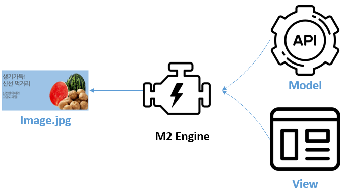
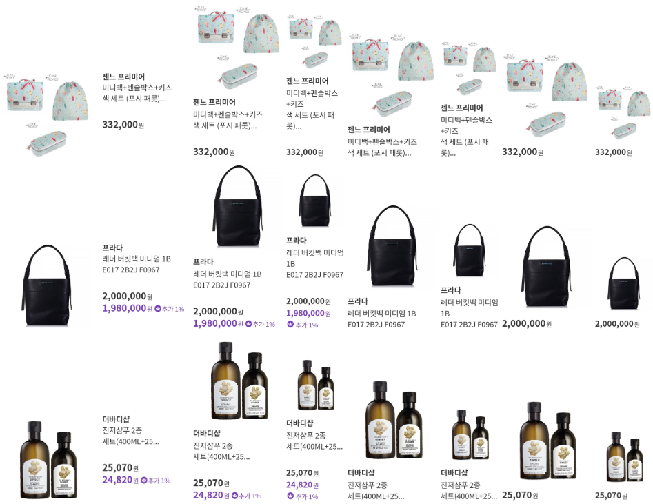
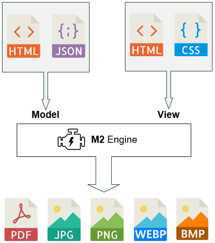
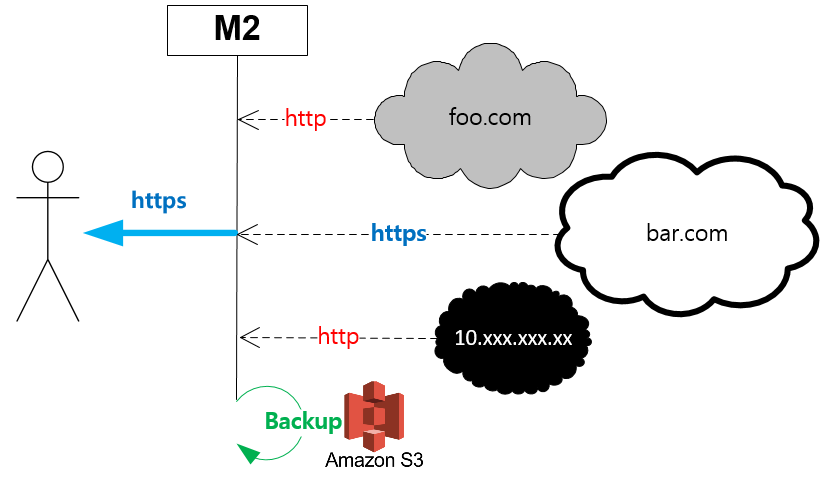
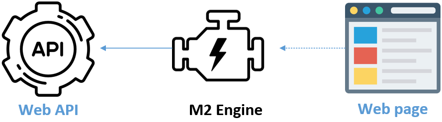
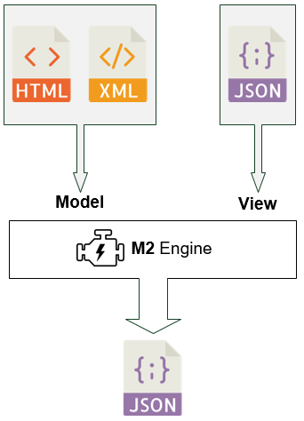

.. _use-cases:

2장. Use Cases
******************

이 장에서는 M2의 활용범위 및 도입사례에 대해 설명한다.

.. toctree::
   :maxdepth: 2

데이터 바인딩 웹 페이지
====================================

Microservice로의 아키텍처 변화는 많은 장점을 가지지만, 데이터 바인딩과 통합의 문제는 여전하다.

.. figure:: img/m2_12.png
   :align: center

다양한 `프런트엔드 프레임워크 <https://www.bitdegree.org/tutorials/front-end-frameworks/>`_ 가 이 문제를 다루고 있지만 다음 문제에 대해 생각해 보아야 한다.

-  개발자만의 기술잔치
-  서버운영의 복잡함과 비용상승
-  기획/마케팅팀의 참여방해

특히 개발자의 손을 빌리지 않고서는 가시성을 얻을 수 없기에 기획/마케팅팀의 참여가 소극적일 수 밖에 없다. Headless/Decoupled CMS에서 정면으로 지적하는 문제가 바로 이것이다.

M2는 Mid-Tier의 간단한 데이터 맵핑만으로 데이터가 바인딩된 웹 페이지를 생산한다. 생산된 웹 페이지는 그 자체로 Decoupled 콘텐츠로 동작하며 운영/배포의 단위가 된다. M2에 내재된 캐싱엔진을 통해 데이터베이스의 질의없이 반복된 페이지에 대해 높은 성능/생산선을 제공한다.

.. _use-cases-image-server:

이미지 서버
====================================

가격, 재고, 판매량등의 실시간 정보가 반영되는 이미지를 생산한다.

=========================== ========================== ============================
항목                         M2                         기존 프로세스
=========================== ========================== ============================
방식                         On the fly                 Batch
서비스 투입                  즉시                        Batch 프로세스 종료 후
저장공간                     STON 캐싱엔진 (LRU)         Storage
형태                         단독 솔루션                 백엔드 시스템
유연성                       API 기반의 높은 유연성       낮음
데이터 변경 반영              즉시                        전체 이미지 일괄재생산
성능                         높음                        낮음
연동범위                      WWW                        기업 백엔드
2차 이미지 가공               STON 이미지툴               추가 프로세스 필요
=========================== ========================== ============================

약속된 이미지 규격(View)에 상품정보를 결합하면 모든 상품의 이미지를 즉시 서비스하거나 변경할 수 있다.

`STON 이미지 툴 <https://ston.readthedocs.io/ko/latest/admin/image.html>`_ 과의 결합을 통해 사용성이 한층 높아진다. ::

   http://example.com/m2-endpoint?model=html&view=jpg/imagetool/resize/100x100
   http://example.com/m2-endpoint?model=html&view=jpg/imagetool/format/webp

How it works
-----------------------------------------------

-  소스는 이미 존재하는 웹 페이지 `HTML` 또는 상품 API(`JSON`)를 이용한다.
-  소스를 반영할 이미지 템플릿은 `HTML` / `CSS` 를 통해 제작한다.
-  출력 포맷(`JPG`, `PNG`, `WEBP`, `BMP`, `PDF`)을 지정하고 URL을 게시한다.

상품기술서 최적화
====================================

상품기술서 관리가 어려운 이유는 개수가 많고 용량이 크기 때문이다.
특히 셀러들에 의해 무분별하게 생성되는 기술서는 혼란을 가중시킨다.

-  고용량 이미지 용량절감

   .. figure:: img/m2_17.png
      :align: center

-  이미지 분할을 통한 로딩품질 개선

   .. figure:: img/m2_18.png
      :align: center

-  반응형 레이아웃 및 스타일 최적화

   .. figure:: img/m2_19.png
      :align: center

M2는 상품기술서나 백엔드 수정없이 즉시 원하는 스타일과 반응성을 제공한다.

이미지 게이트웨이
====================================

백엔드 외부에 존재하는 이미지를 투명하게 자사 백엔드로 연동한다.

외부 이미지를 가져오는 동시에 여러 작업을 동시에 수행할 수 있다.

-  이미지 최적화
-  스토리지 백업 (S3 등)
-  리포팅

Web API 서버
====================================

웹 페이지를 수정 없이 Web API로 제공한다.

How it works
-----------------------------------------------

-  소스는 이미 존재하는 웹 페이지( `HTML` )를 이용한다.
-  소스를 `JSON` 으로 맵핑한다.
-  엔드포인트를 게시한다.

