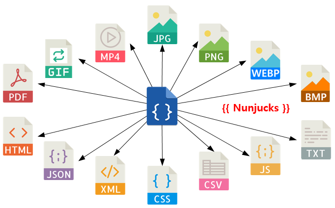
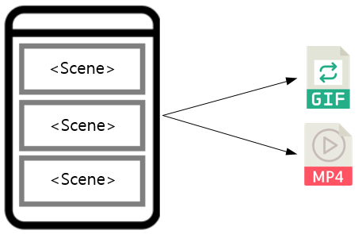

.. _mvc:

6장. View
******************

뷰(View)는 M2-JSON을 가공하여 사용자가 원하는 출력을 생성하는 템플릿을 의미한다. 
`Nunjucks <https://mozilla.github.io/nunjucks/>`_ 언어를 통해 M2-JSON을 다룬다.

.. note::
   
   View가 주어지지 않을 경우 렌더링 없이 Model을 응답한다.

`Nunjucks <https://mozilla.github.io/nunjucks/>`_ 는 Jinja2에 영감을 받은 JavaScript 템플릿 언어이다. 
따라서 기본적인 `Jinja2 <https://jinja.palletsprojects.com/>`_ 의 문법이나 필터를 그대로 사용 가능하다. ::

   {
      "firstName": "John",
      "lastName": "Smith",
      "age": 25,
      "address": {
         "streetAddress": "21 2nd Street",
         "city": "New York",
         "state": "NY",
      "postalCode": "10021"
         },
      "phoneNumber": [
         { "type": "home", "number": "212 555-1234" },
         { "type": "fax", "number": "646 555-4567" }
      ]
   }

`Nunjucks <https://mozilla.github.io/nunjucks/>`_ 형식으로 다음과 같이 참조 가능하다. ::

   {{ model.firstname }}
   {{ model.address.state }}
   {{ model.phoneNumber.0.number }}

조건문, 반복문을 지원한다. ::

   
     I am hungry
   
     I am tired
   
     I am good!
   

::

   <h1>Posts</h1>
   <ul>
   
      <li>{{ item.title }}</li>
   
      <li>This would display if the 'item' collection were empty</li>
   
   </ul>

HTML, XML
====================================

HTML, XML 템플릿을 만든다. ::

   <html>
   <body>
      <H1>{{ model.firstname }} {{ model.lastName }}</H1>
      
{{ model.address.city }}

   </body>
   </html>

JPG, PNG, WEBP, BMP, PDF
====================================

이미지 출력은 HTML 템플릿을 기반으로 렌더링한다. 
<meta> 태그를 통해 출력 포맷을 지정한다. 
다음은 PNG 이미지를 가로 400, 세로 300으로 출력하는 예제이다. ::

   <!DOCTYPE html>
   <html>
      <head>
         <meta name="m2-render-png" content="width=400;height=300;" />
         
      </head>
      <body>
         <H1>{{ model.firstname }} {{ model.lastName }}</H1>
         
{{ model.address.city }}

      </body>
   </html>

이하 이미지 포맷에 따라 ``name`` 값과 지원 옵션이 다르다. 입력되지 않은 기본 값은 다음과 같다.

============== ================= ========================
속성            설명               기본값
============== ================= ========================
``width``       가로 픽셀         400
``height``      세로 픽셀         300
``quality``     JPEG 품질(%)      100
============== ================= ========================

이미지 포맷별 ``<meta>`` 태그 예제는 다음과 같다.

-  JPG ::
      
      <meta name="m2-render-jpg" content="width=400;height=300;quality=85" />

-  PNG ::
      
      <meta name="m2-render-png" content="width=400;height=300;" />

-  WEBP ::
      
      <meta name="m2-render-webp" content="width=400;height=300;quality=85" />

-  BMP ::
      
      <meta name="m2-render-bmp" content="width=400;height=300;" />

-  PDF ::
      
      <meta name="m2-render-pdf" content="width=400;height=300;scale=1;margin-top: 10px;margin-bottom:10px;margin-right:10px;margin-left:10px;" />

MP4, GIF
====================================

비디오, Animated GIF 등 시간흐름이 필요한 포맷은 연속된 장면( ``<Scene>``)을 연결하여 만든다.

다음과 같이 ``<Scene>`` 태그를 통해 각 화면을 구성한다. ::

   <!DOCTYPE html>
   <html>
      <head>
         <meta name="m2-render-gif" content="width=400;height=300;delay=1000;" />
         
      </head>
      <body>
         <Scene>
            

               <H1>{{ model.firstname }} {{ model.lastName }}</H1>
               
{{address.city}}

            

         </Scene>
         <Scene>
            

               <H1>{{ model.lastName }} {{ model.firstname }} </H1>
               
{{ model.address.city }}

            

         </Scene>
         <Scene>
            

               <H1>{{ model.lastName }} {{ model.firstname }} ({{ model.age }})</H1>
               
{{ model.address.city }}

            

         </Scene>
      </body>
   </html>

``<Scene>`` 태그는 의미가 없다. 따라서 ``
`` 를 넣어 영역을 구분하면 개발 단계에서 쉽게 확인이 가능하다.

-  MP4 ::
      
      <meta name="m2-render-mp4" content="width=400;height=300;interval=1000;" />

-  GIF ::
      
      <meta name="m2-render-gif" content="width=400;height=300;delay=1000;" />

   -  장면 시간( ``delay (단위: ms)`` ) = 1000

JSON
====================================

JSON 템플릿을 만든다. ::

   {
      "myName" : "{{firstname}} {{lastName}}",
      "myCity" : "{{address.city}}"
   }

.. _mvc-control:

Control (Web API)
====================================

클라이언트는 M2가 게시한 엔드포인트(API)를 HTTP로 호출한다.

GET Method
====================================

결합할 모델(=정보)과 뷰(=표현)를 QueryString으로 입력한다. ::

   GET /myendpoint?model=wine&view=catalog

POST Method
====================================

Post 메소드는 캐싱되지 않지만 단위 테스트 및 개발 용도로 지원된다. Body와 QueryString을 혼합해 사용 가능하다. ::

   # GET 방식과 동일
   POST /myendpoint?model=wine&view=catalog
   
   { }

::

   # Model과 View 업로드

   POST /myendpoint

   {
        "model" : { ... },
        "view" : "<html>...</hmtl>"
   }

::

   # View만 업로드

   POST /myendpoint?model=wine

   {
       "view" : "<html>...</hmtl>"
   }

::

   # Model만 업로드
   POST /myendpoint?view=catalog

   {
       "model" : { }
   }

